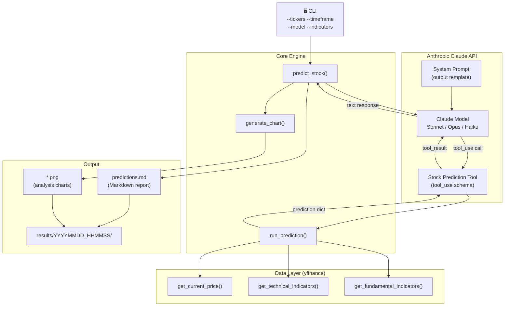
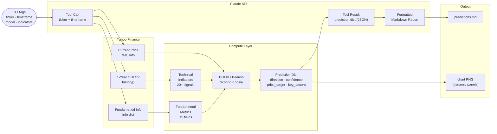
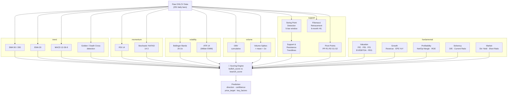
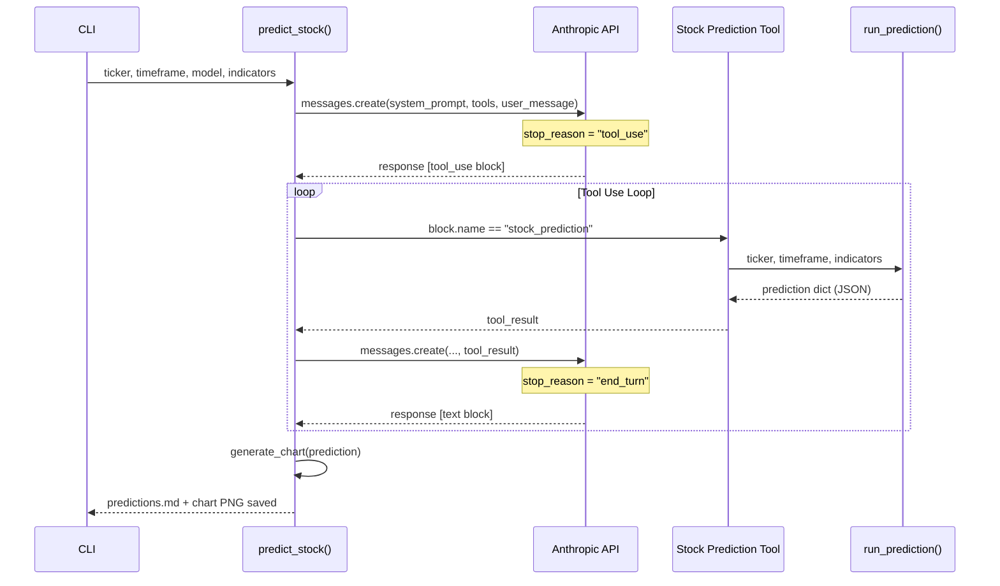
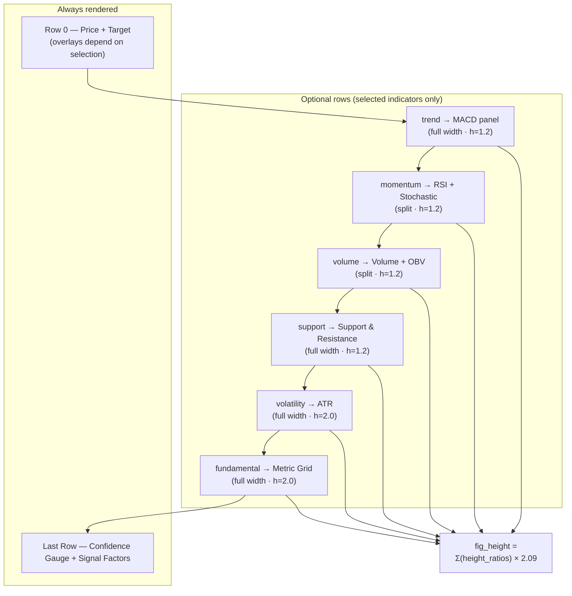
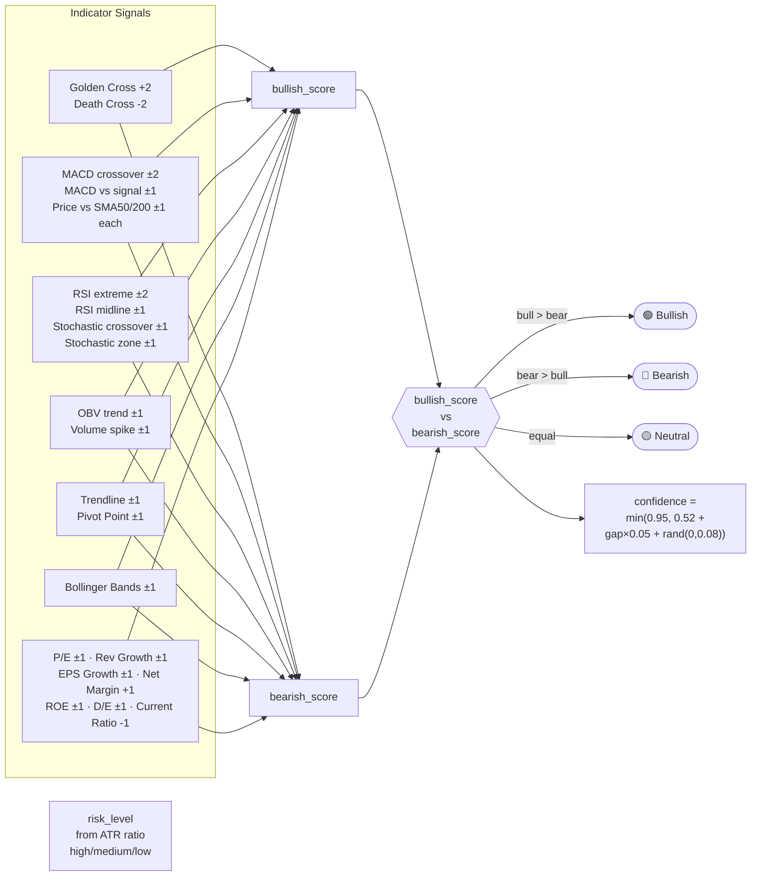

# Stock Predictor — Design Documentation

## Table of Contents

1. [System Architecture](#1-system-architecture)
2. [Data Flow](#2-data-flow)
3. [Indicator Processing Pipeline](#3-indicator-processing-pipeline)
4. [Claude Tool Use Sequence](#4-claude-tool-use-sequence)
5. [Dynamic Chart Layout](#5-dynamic-chart-layout)
6. [Scoring Model](#6-scoring-model)
7. [Output Structure](#7-output-structure)
8. [Design Patterns](#8-design-patterns)
9. [Module Reference](#9-module-reference)
   - [Data Layer](#data-layer)
   - [Scoring Layer](#scoring-layer)
   - [Chart Layer](#chart-layer)
   - [Orchestration](#orchestration)

---

## 1. System Architecture



---

## 2. Data Flow



---

## 3. Indicator Processing Pipeline



---

## 4. Claude Tool Use Sequence



---

## 5. Dynamic Chart Layout

The chart GridSpec is built at runtime based on the active `--indicators` set. Rows are only added for selected categories; the figure height scales proportionally.



**Panel overlay logic (Row 0 — Price chart):**

```
Price line + fill          → always
SMA50 / SMA200 / EMA20     → trend selected
Bollinger Bands            → volatility selected
Support / Resistance TL    → support selected
Golden / Death Cross ★     → trend selected
Target projection arrow    → always
```

---

## 6. Scoring Model



---

## 7. Output Structure

```
results/
└── YYYYMMDD_HHMMSS/
    ├── predictions.md
    │   ├── Report header
    │   │   ├── Tickers · Timeframe · Model · Indicators
    │   │   └── Generated timestamp
    │   └── Per-ticker section
    │       ├── Embedded chart image
    │       ├── 📊 Prediction Summary (table)
    │       │   ├── Direction  (🟢 / 🔴 / 🟡)
    │       │   ├── Confidence (%)
    │       │   ├── Current Price ($)
    │       │   ├── Price Target ($)
    │       │   ├── Target Date
    │       │   └── Risk Level
    │       ├── 🟢 Key Bullish Factors (numbered list)
    │       ├── 🔴 Key Risk Factors / Bearish Signals (numbered list)
    │       ├── 📐 Technical Levels to Watch (pivot points table)
    │       ├── 📏 Fibonacci Retracement Levels (table)
    │       └── 📝 Analysis (2–4 sentence narrative + disclaimer)
    └── charts/
        └── TICKER_TIMEFRAME.png
            ├── Price + Target (always)
            ├── MACD          (trend)
            ├── RSI           (momentum, left)
            ├── Stochastic    (momentum, right)
            ├── Volume        (volume, left)
            ├── OBV           (volume, right)
            ├── Support & Resistance  (support)
            ├── ATR           (volatility)
            ├── Fundamentals  (fundamental)
            ├── Confidence Gauge  (always, left)
            └── Signal Factors    (always, right)
```

---

## 8. Design Patterns

### Pipeline Pattern

Data flows through independent, ordered processing stages. Each stage transforms its input and passes the result to the next.

```
CLI Args → Data Fetch → Indicator Compute → Scoring → Claude API → Formatted Output
```

Each stage is encapsulated in its own function (`get_current_price`, `get_technical_indicators`, `get_fundamental_indicators`, `run_prediction`, `predict_stock`, `generate_chart`), making them independently testable and replaceable.

---

### Strategy Pattern — Indicator Selection

The `--indicators` argument selects which scoring and rendering strategies are active at runtime. Each category is an independent, interchangeable strategy:

```
indicators = {"trend", "momentum", "volatility", "volume", "support", "fundamental"}
             ↓  any subset at runtime
run_prediction()  → applies only selected scoring blocks
generate_chart()  → renders only selected panels
```

---

### Template Method Pattern — Output Consistency

The system prompt defines a fixed output skeleton. The Claude model fills in the variable parts (prices, factors, analysis), but cannot deviate from the structure. This guarantees consistent formatting across all model variants (Sonnet, Opus, Haiku).

```
System Prompt (invariant skeleton)
├── 📊 Summary Table       ← model fills values
├── 🟢 Bullish Factors     ← model fills from key_factors
├── 🔴 Bearish Signals     ← model fills from key_factors
├── 📐 Technical Levels    ← model fills from pivot_points
├── 📏 Fibonacci Levels    ← model fills from fib_levels
└── 📝 Analysis            ← model writes 2–4 sentences
```

---

### Façade Pattern — `predict_stock()`

`predict_stock()` is the single public entry point that hides all subsystem complexity. Callers provide only a ticker, timeframe, model, and indicators — the function orchestrates data fetching, API calls, chart generation, and file I/O internally.

```
predict_stock(ticker, timeframe, model, indicators)
    │
    ├── Claude API loop (tool_use ↔ tool_result)
    │       └── run_prediction() → data fetch + scoring
    ├── generate_chart()
    └── write predictions.md
```

---

### Dynamic Layout Pattern — Chart GridSpec

The chart layout is computed at runtime from the active indicator set rather than being hardcoded. Height ratios and row counts are derived from a declarative panel registry, keeping the layout logic declarative and the rendering code free of conditional skips.

```python
_PANEL_ORDER = [
    ("trend",       "full",  1.2),
    ("momentum",    "split", 1.2),
    ("volume",      "split", 1.2),
    ("support",     "full",  1.2),
    ("volatility",  "full",  2.0),
    ("fundamental", "full",  2.0),
]
optional       = [p for p in _PANEL_ORDER if p[0] in active]
height_ratios  = [2.5] + [h for _, _, h in optional] + [1.2]
fig_height     = sum(height_ratios) × 2.09
```

---

### Configuration Object Pattern — `ScoringConfig`

All scoring thresholds (fundamental cutoffs, RSI/Stochastic levels, ATR ratios, confidence formula constants, price-target ranges) are centralised in a `ScoringConfig` dataclass. Each `_score_*()` helper and `run_prediction()` receive a `cfg` parameter instead of reading hard-coded constants. Callers override thresholds by passing a JSON file via `--config`; fields omitted keep their defaults.

```
ScoringConfig (dataclass, all fields have defaults)
├── Fundamental: pe_bull, pe_bear, rev_growth_bull, earn_growth_bull, ...
├── Technical:   rsi_oversold, rsi_overbought, stoch_*, atr_high, atr_low
└── Confidence:  conf_base, conf_gap_factor, conf_noise_max, conf_cap
```

---

### Prompt Caching

The system prompt is sent with `cache_control: {type: "ephemeral"}`. Anthropic caches the prefix for up to 5 minutes, serving repeated calls (multiple tickers in one run) at ~10% of the normal input token cost.

```
First ticker call  → cache_creation_input_tokens > 0
Subsequent tickers → cache_read_input_tokens > 0  (cache hit)
```

---

## 9. Module Reference

### Data layer

| Function | Signature | Purpose |
|----------|-----------|---------|
| `get_current_price` | `(ticker) → float` | Fetches live price via `fast_info` |
| `get_technical_indicators` | `(ticker) → dict` | Computes all 20+ technical signals from 1-year OHLCV |
| `get_fundamental_indicators` | `(ticker) → dict` | Fetches 15 fundamental metrics from `ticker.info` |
| `_fetch_with_retry` | `(fn, *args, max_retries=3, **kwargs)` | Retry wrapper for flaky yfinance calls |
| `_valid` | `(v) → bool` | Guards against NaN/None in indicator values |

### Scoring layer

| Function | Signature | Purpose |
|----------|-----------|---------|
| `_score_trend` | `(tech, base_price, cfg) → (bull, bear, factors)` | Scores SMA/EMA/MACD/cross signals |
| `_score_momentum` | `(tech, cfg) → (bull, bear, factors)` | Scores RSI and Stochastic signals |
| `_score_volatility` | `(tech, cfg) → (bull, bear, factors)` | Scores Bollinger Bands and ATR |
| `_score_volume` | `(tech, cfg) → (bull, bear, factors)` | Scores OBV trend and volume spikes |
| `_score_support` | `(tech, base_price, cfg) → (bull, bear, factors)` | Scores trendlines and pivot points |
| `_score_fundamental` | `(fund, cfg) → (bull, bear, factors)` | Scores all 15 fundamental metrics |
| `run_prediction` | `(ticker, timeframe, indicators, config) → dict` | Orchestrates scoring and builds the prediction dict |

### Chart layer

| Function | Signature | Purpose |
|----------|-----------|---------|
| `_style_ax` | `(ax)` | Applies dark-theme style to an axes |
| `_display_slice` | `(tech, n=126) → (start, dates, closes)` | Returns the last `n` bars for display |
| `_draw_price_panel` | `(ax, tech, active, ...)` | Renders the price + overlays + target row |
| `_draw_macd_panel` | `(ax, tech)` | Renders the MACD histogram and lines |
| `_draw_rsi_panel` | `(ax, tech)` | Renders RSI with overbought/oversold zones |
| `_draw_stoch_panel` | `(ax, tech)` | Renders Stochastic %K/%D |
| `_draw_volume_panel` | `(ax, tech)` | Renders volume bars with spike markers |
| `_draw_obv_panel` | `(ax, tech)` | Renders OBV cumulative line |
| `_draw_support_panel` | `(ax, tech, main_color)` | Renders Fibonacci, pivot points, and trendlines |
| `_draw_atr_panel` | `(ax, tech)` | Renders ATR with mean and volatility fill |
| `_draw_fundamental_panel` | `(ax, fund)` | Renders 15-metric colour-coded grid |
| `_draw_confidence_gauge` | `(ax, confidence, risk, direction, ...)` | Renders arc gauge with risk pill |
| `_draw_signal_factors` | `(ax, factors, main_color)` | Renders horizontal bar chart of signals |
| `generate_chart` | `(prediction, charts_dir) → str` | Assembles GridSpec, calls draw helpers; returns PNG path |

### Orchestration

| Function | Signature | Purpose |
|----------|-----------|---------|
| `predict_stock` | `(ticker, timeframe, md_file, charts_dir, model, indicators, config)` | Top-level orchestrator: API loop + chart + report |

**Prediction dict schema:**

```python
{
    "ticker":        str,          # e.g. "AAPL"
    "timeframe":     str,          # e.g. "3m"
    "direction":     str,          # "bullish" | "bearish" | "neutral"
    "confidence":    float,        # 0.52 – 0.95
    "current_price": float,
    "price_target":  float,
    "target_date":   str,          # ISO date
    "key_factors":   list[str],    # up to 6 signal descriptions
    "risk_level":    str,          # "low" | "medium" | "high"
    "technical":     dict | None,  # full technical indicator arrays
    "fundamental":   dict | None,  # fundamental metrics snapshot
    "indicators":    list[str],    # sorted active categories
}
```
