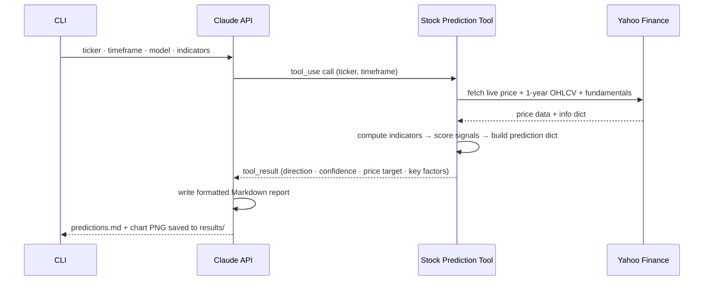

# Stock Predictor

A Python application that uses the [Anthropic SDK](https://github.com/anthropics/anthropic-sdk-python) and Claude's tool use feature to predict stock performance. Claude calls the **Stock Prediction** tool to compute real technical indicators and generate predictions, then delivers a structured analysis with price targets, confidence scores, and trend signals — saved as a Markdown report with analysis charts.

## How It Works



1. You specify one or more tickers and a timeframe via CLI arguments
2. Claude invokes the **Stock Prediction** tool with the ticker and timeframe
3. Stock Prediction fetches the **real current price**, computes technical indicators (SMA, EMA, MACD, RSI, Bollinger Bands, ATR, OBV, trendlines, pivot points, Fibonacci) and fundamental metrics (P/E, growth, margins, debt) from Yahoo Finance
4. Direction and confidence are derived by scoring all selected indicator signals
5. Claude analyzes the data and writes a formatted Markdown report
6. An analysis chart (PNG) is generated per ticker — only the selected indicator panels are included
7. All output is saved into a timestamped folder under `results/`

## Requirements

- Python 3.8+
- An [Anthropic API key](https://console.anthropic.com) with available credits

## Dependencies

| Package | Version | Purpose |
|---------|---------|---------|
| `anthropic` | 0.96.0 | Claude API SDK and tool use |
| `yfinance` | 1.3.0 | Live stock price data from Yahoo Finance |
| `matplotlib` | 3.10.8 | Analysis chart generation |
| `numpy` | 2.4.4 | Numerical operations for chart rendering |

## Setup

```bash
# Clone or download the project
cd stock-prediction

# Create and activate a virtual environment
python3 -m venv .venv
source .venv/bin/activate  # macOS/Linux
# .venv\Scripts\activate   # Windows

# Install dependencies
pip install -r requirements.txt

# Set your API key
export ANTHROPIC_API_KEY=sk-ant-...
```

## Usage

### Run with defaults

```bash
python stock_predictor.py
```

Runs predictions for **AAPL** (1w), **TSLA** (1m), and **INTC** (1m).

### Specify tickers

```bash
python stock_predictor.py --tickers NVDA
python stock_predictor.py --tickers AAPL TSLA NVDA
```

### Specify tickers and timeframe

```bash
python stock_predictor.py --tickers MSFT --timeframe 3m
python stock_predictor.py --tickers GOOG AMZN --timeframe 1d
python stock_predictor.py --tickers NVDA --timeframe 6m
python stock_predictor.py --tickers AAPL --model claude-opus-4-7
```

### Select indicator categories

Run with only a subset of indicator categories. Omitting a category removes it from both the scoring engine and the chart panels.

```bash
# Trend and momentum only
python stock_predictor.py --tickers AAPL --indicators trend momentum

# Volatility and volume only
python stock_predictor.py --tickers TSLA --indicators volatility volume

# Fundamentals only
python stock_predictor.py --tickers MSFT --indicators fundamental

# Single category
python stock_predictor.py --tickers NVDA --indicators support
```

### All options

```
usage: stock_predictor.py [-h] [--tickers TICKER [TICKER ...]]
                          [--timeframe {1d,1w,1m,3m,6m,ytd,1y,2y,5y}]
                          [--model MODEL]
                          [--indicators INDICATOR [INDICATOR ...]]

options:
  --tickers     One or more stock ticker symbols (default: AAPL TSLA INTC)
  --timeframe   Prediction timeframe: 1d 1w 1m 3m 6m ytd 1y 2y 5y (default: 1w)
  --model       Claude model ID to use (default: claude-sonnet-4-6)
  --indicators  Indicator categories to include (default: all six)
                Choices: trend  momentum  volatility  volume  support  fundamental
```

### Supported timeframes

| Value | Meaning             |
|-------|---------------------|
| `1d`  | 1 day               |
| `1w`  | 1 week              |
| `1m`  | 1 month             |
| `3m`  | 3 months            |
| `6m`  | 6 months            |
| `ytd` | Year to date        |
| `1y`  | 1 year              |
| `2y`  | 2 years             |
| `5y`  | 5 years             |

### Supported models

| Model ID | Notes |
|----------|-------|
| `claude-sonnet-4-6` | Default — fast and cost-effective |
| `claude-opus-4-7` | Most capable, higher cost |
| `claude-haiku-4-5-20251001` | Fastest and cheapest |

## Output

Each run creates a timestamped folder under `results/`:

```
results/
└── 20260419_041029/
    ├── predictions.md       ← Markdown report with embedded chart images
    └── charts/
        ├── AAPL_1w.png
        ├── TSLA_1m.png
        └── INTC_1m.png
```

### Markdown report

The `predictions.md` file contains a full analysis per ticker with each chart embedded inline. The report header records the tickers, timeframe, model, and active indicator categories. Each ticker section contains:

| Section | Content |
|---------|---------|
| **📊 Prediction Summary** | Table with direction, confidence, current price, price target, target date, and risk level |
| **🟢 Key Bullish Factors** | Numbered list of signals supporting the bullish case |
| **🔴 Key Risk Factors / Bearish Signals** | Numbered list of opposing signals or risks to the thesis |
| **📐 Technical Levels to Watch** | Pivot points table — R2, R1, PP, S1, S2 |
| **📏 Fibonacci Retracement Levels** | Full Fibonacci table from 0% to 100% of the 6-month range |
| **📝 Analysis** | 2–4 sentence narrative referencing key signals and levels |

### Analysis charts

The chart is built dynamically — only panels for selected indicator categories are included, and the figure height scales accordingly. The two panels below are always present regardless of indicator selection:

| Panel | Always shown | Description |
|-------|:---:|-------------|
| **Price + Target** | ✓ | 6-month price with projected target; overlays (SMA/EMA, BB, trendlines, cross markers) appear only if their category is selected |
| **Confidence & Risk** | ✓ | Arc gauge showing confidence %, risk pill (ATR-derived), and direction label |
| **Technical Signal Factors** | ✓ | Horizontal bar chart of the indicator signals that drove the direction |

Optional panels — included only when the matching `--indicators` category is selected:

| Panel | Category | Description |
|-------|----------|-------------|
| **MACD (12, 26, 9)** | `trend` | Histogram (green/red bars), MACD line, and signal line with current crossover status in the title |
| **RSI (14)** | `momentum` | RSI line with overbought (>70) and oversold (<30) fill zones; current value and zone label in title |
| **Stochastic (14, 3)** | `momentum` | %K (fast) and %D (signal) lines with overbought (>80) and oversold (<20) fill zones; current values in title |
| **Volume + Spikes** | `volume` | Bar chart coloured green (up day) / red (down day), 20-day mean line, and gold triangle markers for volume spikes (>2σ above mean) |
| **OBV (On-Balance Volume)** | `volume` | Cumulative OBV line coloured by trend (green=rising, red=falling) with fill; trend label in title |
| **Support & Resistance** | `support` | Last 60 days of price with Fibonacci retracement levels (0%–100%), Pivot Points (PP/R1/R2/S1/S2), and trendlines — all labelled with price values |
| **ATR (14)** | `volatility` | ATR line coloured by volatility level, 20-day ATR mean (dashed), fill shaded red above mean / green below; current value and ratio in title |
| **Fundamental Indicators** | `fundamental` | Grid of 15 key metrics (valuation, growth, margins, debt, liquidity) — each cell colour-coded green/amber/red by signal strength |

## Technical Indicators

All indicators are computed from Yahoo Finance data. Technical indicators use 1 year of daily OHLCV history; fundamental metrics are fetched from the ticker's latest info snapshot. They are grouped into six categories selectable via `--indicators`.

### `trend`

| Indicator | Detail |
|-----------|--------|
| **SMA50** | 50-day simple moving average |
| **SMA200** | 200-day simple moving average |
| **EMA20** | 20-day exponential moving average |
| **Golden Cross** | SMA50 crosses above SMA200 — bullish long-term signal (+2 pts) |
| **Death Cross** | SMA50 crosses below SMA200 — bearish long-term signal (+2 pts) |
| **MACD (12, 26, 9)** | MACD line (EMA12 − EMA26), signal line (EMA9 of MACD), histogram |
| **MACD crossover** | MACD line crossing above/below signal line (+2 pts) |
| **Price vs SMA50/200** | Whether price trades above or below each MA (+1 pt each) |

### `momentum`

| Indicator | Detail |
|-----------|--------|
| **RSI (14)** | <30 oversold = bullish (+2 pts), >70 overbought = bearish (+2 pts), above/below 50 midline (+1 pt) |
| **Stochastic (14, 3)** | %K/%D crossover (+1 pt); %K <20 oversold = bullish (+1 pt), >80 overbought = bearish (+1 pt) |

### `volatility`

| Indicator | Detail |
|-----------|--------|
| **Bollinger Bands (20, 2)** | Price above upper band = overbought → bearish (+1 pt); price below lower band = oversold → bullish (+1 pt) |
| **ATR (14)** | Drives the `risk_level` field: ATR > 1.3× 20-day avg = high, < 0.8× = low, otherwise medium; also reported as a key factor |

### `volume`

| Indicator | Detail |
|-----------|--------|
| **OBV** | Rising OBV = bullish (+1 pt), falling OBV = bearish (+1 pt) |
| **Volume Spike** | Spike on up day = bullish (+1 pt), spike on down day = bearish (+1 pt); spike = volume > 20-day mean + 2σ |

### `fundamental`

| Indicator | Detail |
|-----------|--------|
| **P/E (TTM)** | Trailing P/E; < 15 = bullish (+1 pt), > 35 = bearish (+1 pt) |
| **Forward P/E** | Forward P/E consensus estimate |
| **P/B** | Price-to-book; < 2 = attractive |
| **P/S** | Price-to-sales (trailing 12 months) |
| **EV/EBITDA** | Enterprise value to EBITDA |
| **PEG Ratio** | P/E relative to earnings growth; < 1 = undervalued |
| **Revenue Growth** | Year-over-year revenue growth; > 10% = bullish (+1 pt), < 0% = bearish (+1 pt) |
| **EPS Growth** | Year-over-year earnings growth; > 15% = bullish (+1 pt), < 0% = bearish (+1 pt) |
| **Net Margin** | Net profit margin; > 15% = bullish (+1 pt) |
| **Operating Margin** | Operating profit margin |
| **ROE** | Return on equity; > 15% = bullish (+1 pt), < 0% = bearish (+1 pt) |
| **Debt/Equity** | D/E ratio; < 0.5× = bullish (+1 pt), > 2× = bearish (+1 pt) |
| **Current Ratio** | Liquidity ratio; < 1.0 = bearish (+1 pt) |
| **Dividend Yield** | Annual dividend as % of price |
| **Short Ratio** | Days to cover short interest |

### `support`

| Indicator | Detail |
|-----------|--------|
| **Trendlines** | Rising support trendline + price above it = bullish (+1 pt); price breaks below support = bearish (+1 pt); detected via 5-bar swing point window |
| **Pivot Points** | Price above PP = bullish (+1 pt), below = bearish (+1 pt); PP/R1/R2/S1/S2 computed from most recent bar's H, L, C |
| **Fibonacci Retracement** | 6-month H/L range; 38.2%, 50%, 61.8% levels shown as key support/resistance reference lines (visual context, not scored) |

Direction (`bullish` / `bearish` / `neutral`) and confidence are derived by scoring these signals — no random guessing.

## Stock Prediction Tool Reference

The **Stock Prediction** tool is defined as an Anthropic tool-use schema. Claude calls it automatically when asked for a stock prediction.

**Input parameters:**

| Parameter   | Type   | Required | Description                                       |
|-------------|--------|----------|---------------------------------------------------|
| `ticker`    | string | Yes      | Stock ticker symbol (e.g., `AAPL`, `TSLA`)        |
| `timeframe` | string | No       | One of `1d`, `1w`, `1m`, `3m`, `6m`, `ytd`, `1y`, `2y`, `5y` — defaults to `1w` |

**Output fields:**

| Field           | Description                                                     |
|-----------------|-----------------------------------------------------------------|
| `ticker`        | Uppercased ticker symbol                                        |
| `timeframe`     | Requested prediction window                                     |
| `direction`     | `bullish`, `bearish`, or `neutral` — derived from indicator scores |
| `confidence`    | Confidence score scaled by signal strength                      |
| `current_price` | Live price fetched from Yahoo Finance                           |
| `price_target`  | Projected price at the end of the timeframe                     |
| `target_date`   | ISO date when the target should be reached                      |
| `key_factors`   | Up to 6 indicator signals that drove the direction              |
| `risk_level`    | `low`, `medium`, or `high`                                      |
| `fundamental`   | Fundamental metrics dict (P/E, growth, margins, debt, etc.)     |
| `indicators`    | Sorted list of active indicator categories used for this run    |

## Project Structure

```
stock-prediction/
├── stock_predictor.py   # Main application
├── requirements.txt     # Python dependencies
├── README.md            # This file
├── results/             # Output from each run (auto-created)
│   └── YYYYMMDD_HHMMSS/
│       ├── predictions.md
│       └── charts/
└── .venv/               # Virtual environment (not committed)
```

## Prompt Caching

The system prompt is marked with `cache_control: {type: "ephemeral"}`. On repeated calls within a 5-minute window, Anthropic serves the cached prefix at ~10% of the normal input token cost. Cache hits appear in the output as:

```
Cache read: 312 tokens
```

> Note: Caching requires a minimum prefix length (~2048 tokens for Sonnet). The system prompt includes a detailed output format template, which is typically long enough to meet this threshold.

## Disclaimer

Predictions are for **demonstration purposes only**. Current prices and indicator data are fetched live from Yahoo Finance, and direction/confidence are derived from real technical signals — but technical analysis does not guarantee future performance. This tool should not be used to make investment decisions.
