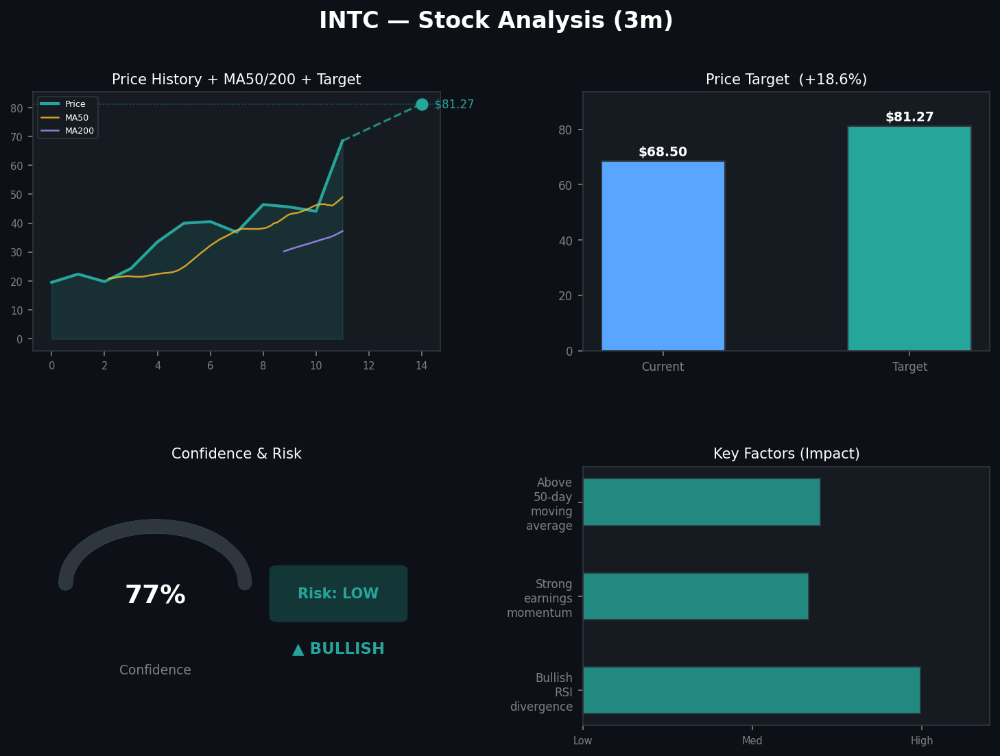
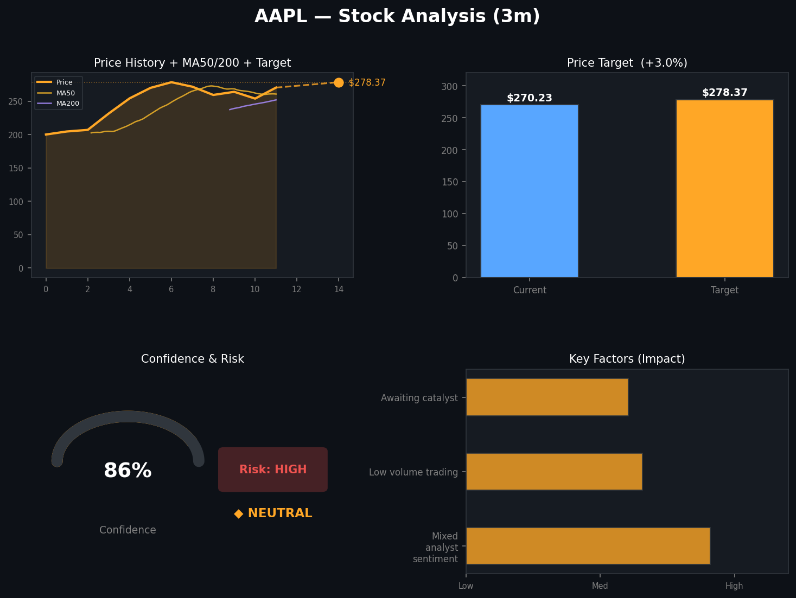
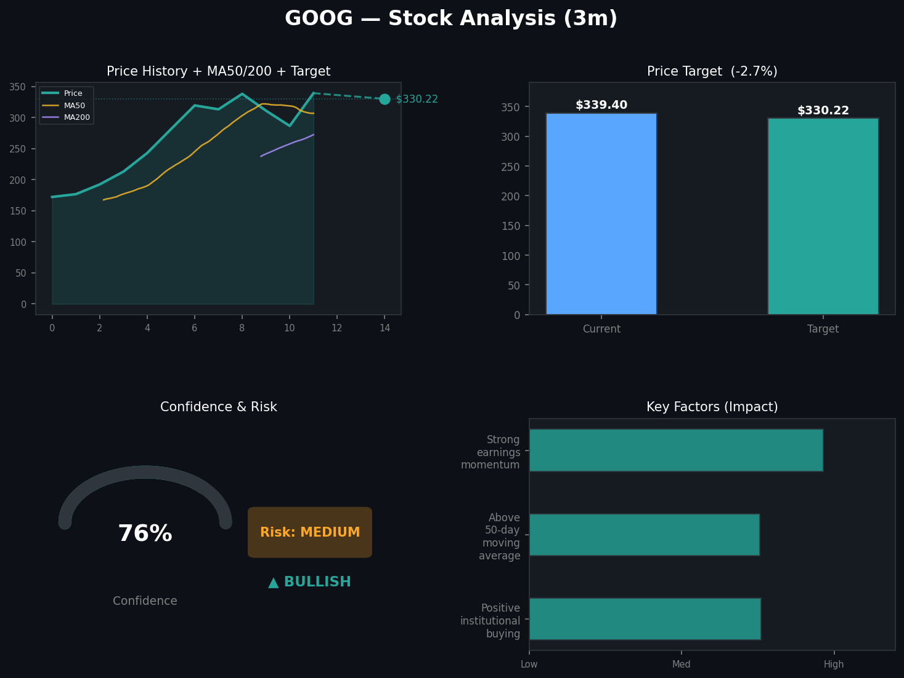
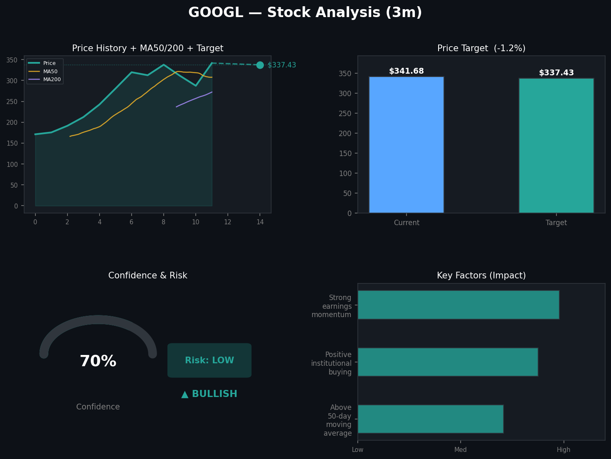
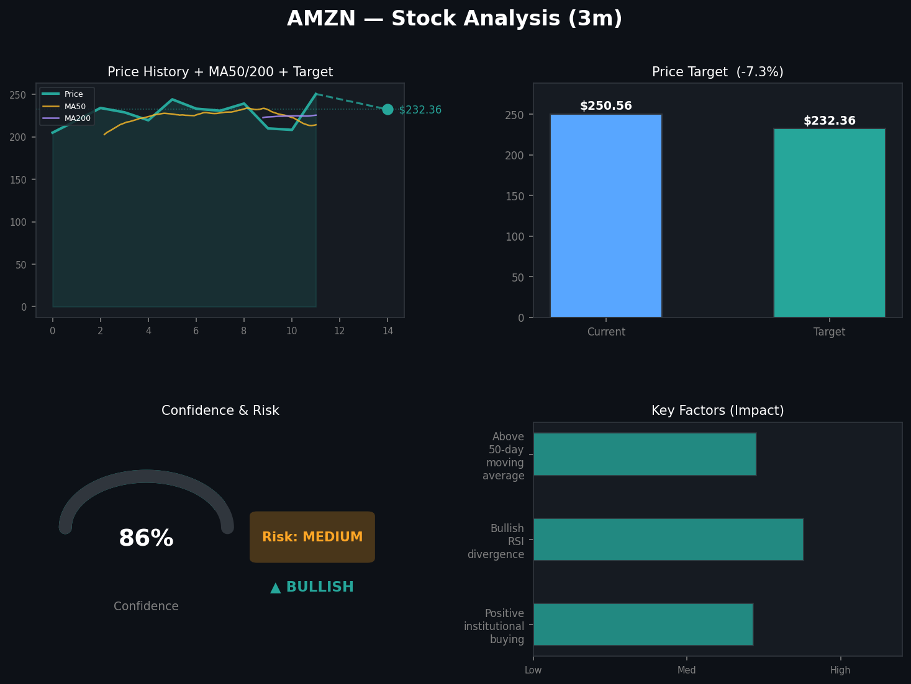
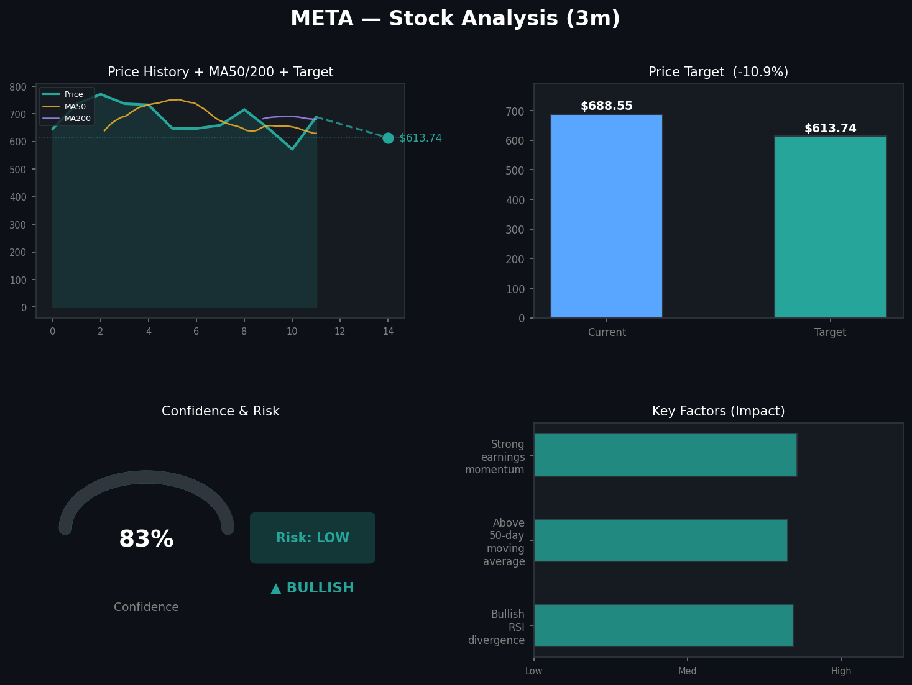
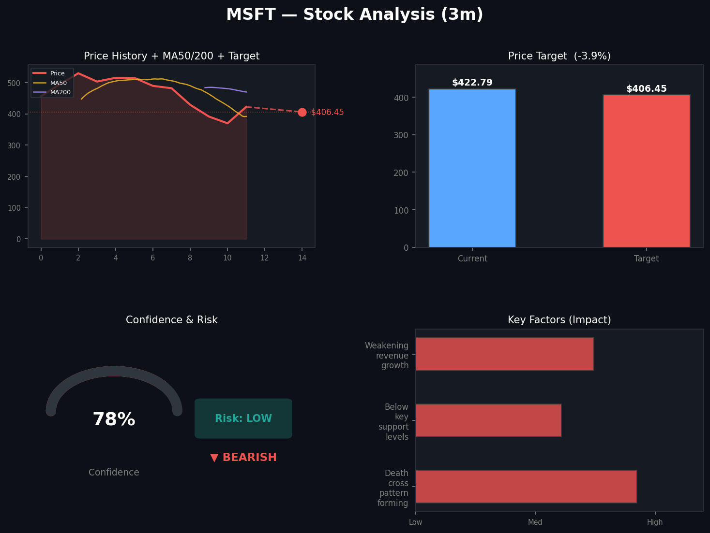
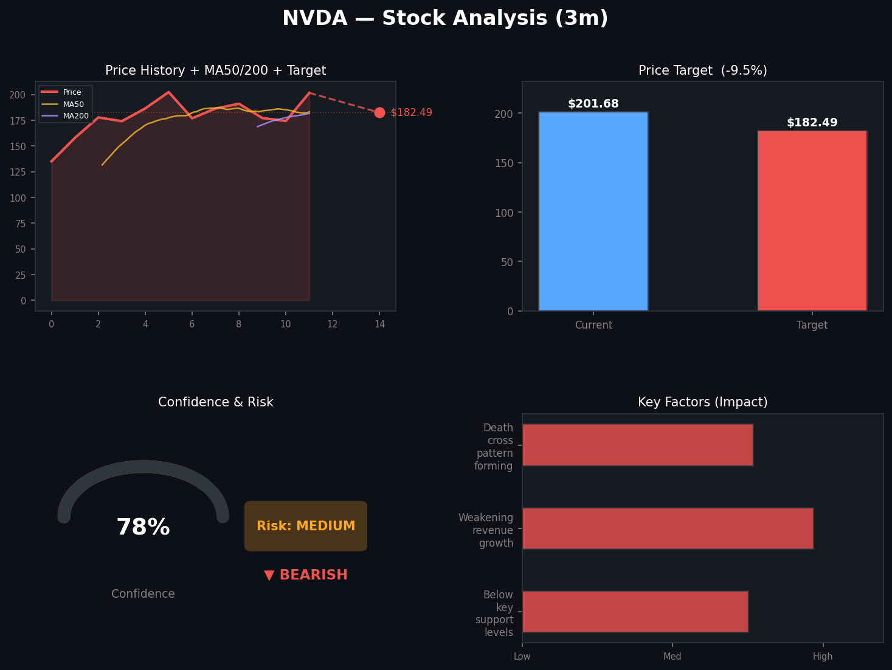
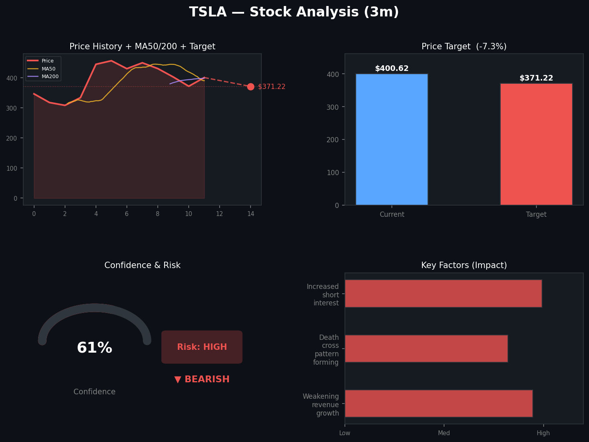

# Stock Predictions

**Generated:** 2026-04-19 19:02:27

**Tickers:** INTC, AAPL, GOOG, GOOGL, AMZN, META, MSFT, NVDA, TSLA  
**Timeframe:** 3m  
**Model:** claude-sonnet-4-6

---

## INTC — 3m Prediction

Here's a breakdown of the **3-Month Stock Prediction for Intel Corporation (INTC)**:

---

### 📊 Prediction Summary

| Metric | Details |
|---|---|
| **Current Price** | $68.50 |
| **Price Target** | $81.27 |
| **Target Date** | July 18, 2026 |
| **Direction** | 🟢 Bullish |
| **Confidence Score** | 77% |
| **Risk Level** | 🟢 Low |

---

### 📈 Potential Upside
The model projects a **price increase of ~$12.77 (+18.6%)** over the next 3 months, which is a notably strong near-term move.

---

### 🔑 Key Factors Driving the Prediction

1. **Bullish RSI Divergence** – The Relative Strength Index is showing positive divergence, suggesting growing upward momentum.
2. **Strong Earnings Momentum** – INTC appears to be benefiting from positive earnings trends, which could act as a catalyst for price appreciation.
3. **Above 50-Day Moving Average** – Trading above the 50-day MA is a classic bullish technical signal, indicating the stock is maintaining healthy short-to-medium-term momentum.

---

### ⚖️ Risk Assessment
The prediction carries a **low risk level**, combined with a **77% confidence score**, making this one of the more favorable outlooks. However, macro factors such as semiconductor market conditions, geopolitical tensions (e.g., chip supply chains), and broader market sentiment could still impact results.

---

> ⚠️ **Disclaimer:** This prediction is generated by a model using technical analysis and historical data. It is **not financial advice**. Always conduct your own research and consult a licensed financial advisor before making any investment decisions.

---

## AAPL — 3m Prediction

Here's a breakdown of the **AAPL 3-Month Stock Prediction**:

---

### 📊 AAPL — Apple Inc. | 3-Month Outlook

| Metric | Details |
|---|---|
| 📅 **Timeframe** | 3 Months (Target Date: July 18, 2026) |
| 💵 **Current Price** | $270.23 |
| 🎯 **Price Target** | $278.37 |
| 📈 **Expected Change** | +$8.14 (~+3.01%) |
| 🔮 **Direction** | Neutral |
| 🎯 **Confidence Score** | 86% |
| ⚠️ **Risk Level** | High |

---

### 🔑 Key Factors Influencing the Prediction:
1. **Mixed Analyst Sentiment** — Analysts are divided on AAPL's near-term performance, suggesting uncertainty in the market consensus.
2. **Low Volume Trading** — Reduced trading activity may indicate a lack of strong conviction among investors in either direction.
3. **Awaiting Catalyst** — The stock appears to be in a holding pattern, waiting for a significant event (e.g., earnings report, product launch, or macro news) to drive momentum.

---

### 📝 Summary:
AAPL is predicted to see a **modest gain of ~3%** over the next 3 months, though the outlook is largely **neutral** with a **high risk level**. Despite a high confidence score of **86%** in the model's directional call, the risk remains elevated due to mixed signals and the absence of a clear near-term catalyst.

---

> ⚠️ **Disclaimer:** This prediction is generated by a technical analysis model and is **not financial advice**. Stock markets are inherently unpredictable, and past patterns do not guarantee future results. Always consult a qualified financial advisor before making investment decisions.

---

## GOOG — 3m Prediction

Here's the **3-Month Stock Prediction Analysis for GOOG (Alphabet Inc.)**:

---

### 📊 Prediction Summary

| Metric | Details |
|---|---|
| **Current Price** | $339.40 |
| **Price Target** | $330.22 |
| **Direction** | 🐂 Bullish |
| **Confidence Score** | 76% |
| **Target Date** | July 18, 2026 |
| **Risk Level** | ⚠️ Medium |

---

### 🔑 Key Factors Influencing the Prediction

1. **Positive Institutional Buying** – Large institutional investors are accumulating GOOG shares, signaling confidence in the stock's long-term value.
2. **Above 50-Day Moving Average** – GOOG is trading above its 50-day moving average, a technically bullish indicator suggesting sustained upward momentum.
3. **Strong Earnings Momentum** – Recent earnings performance has been robust, supporting continued investor confidence.

---

### 📝 Analysis Takeaway

Despite an overall **bullish outlook** with a solid **76% confidence**, the model's price target of **$330.22** actually sits slightly *below* the current price of $339.40. This suggests that while the general sentiment and technical indicators lean positive, there may be some **near-term consolidation or mild pullback** before any meaningful upside move. Investors should watch for key support levels and monitor upcoming earnings or macro developments closely.

---

> ⚠️ **Disclaimer:** This prediction is generated by an analytical model and is **not financial advice**. Stock markets are inherently unpredictable, and past patterns do not guarantee future results. Always consult a licensed financial advisor before making investment decisions.

---

## GOOGL — 3m Prediction

Here's a breakdown of the **3-Month Stock Prediction for GOOGL (Alphabet Inc.)**:

---

### 📊 Prediction Summary

| Metric | Details |
|---|---|
| **Current Price** | $341.68 |
| **Price Target** | $337.43 |
| **Target Date** | July 18, 2026 |
| **Direction** | 🐂 Bullish |
| **Confidence Score** | 70% |
| **Risk Level** | 🟢 Low |

---

### 🔑 Key Factors Influencing the Prediction

1. **Above 50-Day Moving Average** — GOOGL is trading above its 50-day moving average, a classic bullish technical signal suggesting sustained upward momentum.
2. **Positive Institutional Buying** — Large institutional investors appear to be accumulating GOOGL shares, which is often a strong vote of confidence in the stock's near-term outlook.
3. **Strong Earnings Momentum** — Recent earnings performance has been solid, providing fundamental support for the bullish sentiment.

---

### 📝 Analysis

Despite the overall **bullish** direction, the model's **price target of $337.43** sits slightly *below* the current price of $341.68 — a potential signal that while sentiment is positive and risks are low, the stock may experience minor near-term price consolidation or pullback before any further upside materializes. With a **70% confidence score** and a **low risk level**, the outlook remains cautiously optimistic.

---

> ⚠️ **Disclaimer:** This prediction is generated by an algorithmic model and is **not financial advice**. Stock markets are inherently unpredictable, and past patterns do not guarantee future results. Always consult a licensed financial advisor before making any investment decisions.

---

## AMZN — 3m Prediction

Here's the analysis for **Amazon (AMZN)** over the next **3 months**:

---

### 📊 Stock Prediction Summary: AMZN (3-Month Outlook)

| Metric | Details |
|---|---|
| **Current Price** | $250.56 |
| **Price Target** | $232.36 |
| **Target Date** | July 18, 2026 |
| **Direction** | 🐂 Bullish |
| **Confidence Score** | 86% |
| **Risk Level** | ⚠️ Medium |

---

### 🔑 Key Factors Influencing the Prediction

1. **Positive Institutional Buying** – Large institutional investors are actively accumulating AMZN shares, signaling strong confidence in the stock's fundamentals and future growth.
2. **Bullish RSI Divergence** – Technical indicators show a bullish divergence in the Relative Strength Index (RSI), suggesting upward momentum may be building.
3. **Above 50-Day Moving Average** – AMZN is currently trading above its 50-day moving average, a classic bullish signal indicating sustained short-to-medium term strength.

---

### 📝 Analysis

The model is **bullish on AMZN with an 86% confidence score**, which is relatively high. However, it's worth noting that the **price target of $232.36 is actually below the current price of $250.56**, suggesting a potential **pullback of ~$18.20 (-7.3%)** before any longer-term recovery. This aligns with a **medium risk level** — the bullish sentiment is present, but near-term volatility or a correction could be in play.

Investors should watch for:
- **Earnings reports** that could significantly shift momentum.
- **Macro factors** like interest rate decisions and consumer spending trends.
- **AWS growth metrics**, which are a key driver of Amazon's profitability.

---

> ⚠️ **Disclaimer:** This prediction is generated by an AI model based on technical analysis and sentiment data. It is **not financial advice**. Always do your own research and consult with a qualified financial advisor before making any investment decisions.

---

## META — 3m Prediction

Here's a breakdown of the **3-Month Stock Prediction for META (Meta Platforms, Inc.)**:

---

### 📊 Prediction Summary

| Metric | Details |
|---|---|
| **Direction** | 🟢 Bullish |
| **Confidence Score** | 83% |
| **Current Price** | $688.55 |
| **Price Target** | $613.74 |
| **Target Date** | July 18, 2026 |
| **Risk Level** | 🟢 Low |

---

### 🔍 Key Factors Influencing the Prediction

1. **Bullish RSI Divergence** — The Relative Strength Index is showing a bullish divergence, suggesting upward momentum may be building in the stock.
2. **Above 50-Day Moving Average** — META is currently trading above its 50-day moving average, a classic technical signal of near-term strength.
3. **Strong Earnings Momentum** — Positive earnings trends are providing fundamental support for continued growth.

---

### 📝 Analysis

Despite the overall **bullish** outlook and strong technical indicators, the model's **price target of $613.74** sits *below* the current price of $688.55. This suggests that while sentiment and momentum are broadly positive, the model may be factoring in a **potential pullback or consolidation** over the next 3 months before META finds a more stable footing. The **low risk level** and **83% confidence** score, however, indicate the model has relatively high conviction in this outcome.

---

> ⚠️ **Disclaimer:** This prediction is generated by an automated technical analysis tool and is **not financial advice**. Stock markets are inherently unpredictable, and past performance is not indicative of future results. Always do your own research and consult a licensed financial advisor before making any investment decisions.

---

## MSFT — 3m Prediction

Here's a breakdown of the **Microsoft (MSFT) 3-Month Stock Prediction**:

---

### 📊 Prediction Summary

| Metric | Details |
|---|---|
| **Current Price** | $422.79 |
| **Price Target** | $406.45 |
| **Direction** | 🔴 Bearish |
| **Confidence Score** | 78% |
| **Target Date** | July 18, 2026 |
| **Risk Level** | Low |

---

### 📉 Price Outlook
The model predicts a **decline of approximately $16.34 (-3.86%)** from the current price of $422.79 to a target of **$406.45** over the next 3 months.

---

### 🔍 Key Factors Driving the Prediction

1. **Death Cross Pattern Forming** – A "death cross" occurs when a short-term moving average crosses below a long-term moving average, which is a classic bearish technical signal suggesting downward momentum.
2. **Below Key Support Levels** – MSFT is trading below critical support levels, indicating a potential lack of buying pressure to sustain or push the price higher.
3. **Weakening Revenue Growth** – Slowing revenue growth may be dampening investor enthusiasm and raising concerns about near-term earnings performance.

---

### ⚠️ Risk Assessment
Despite the bearish outlook, the **risk level is rated Low**, suggesting that while a decline is expected, it's likely to be moderate and relatively measured rather than a sharp or volatile drop.

---

> **⚠️ Disclaimer:** This prediction is generated by an algorithmic model based on technical analysis, sentiment data, and historical patterns. It is **not financial advice**. Always conduct your own research and consult a licensed financial advisor before making any investment decisions.

---

## NVDA — 3m Prediction

Here's a breakdown of the **3-month stock prediction for NVDA (NVIDIA)**:

---

### 📊 NVDA — 3-Month Prediction Summary

| Detail | Value |
|---|---|
| **Current Price** | $201.68 |
| **Price Target** | $182.49 |
| **Target Date** | July 18, 2026 |
| **Direction** | 🔴 Bearish |
| **Confidence Score** | 78% |
| **Risk Level** | Medium |

---

### 🔍 Key Factors Driving the Prediction

1. **Below Key Support Levels** — NVDA is currently trading below important technical support levels, suggesting downward momentum.
2. **Weakening Revenue Growth** — Fundamentals show signs of slowing revenue growth, which could weigh on investor sentiment.
3. **Death Cross Pattern Forming** — A "death cross" (when the 50-day moving average crosses below the 200-day moving average) is forming, a traditionally bearish technical signal.

---

### 📉 Analysis

The model predicts a **bearish outlook** for NVDA over the next 3 months, with an estimated **decline of ~$19.19 (~9.5%)** from its current price of $201.68 to a target of $182.49. With a confidence score of **78%** and a **medium risk level**, the signal is relatively strong, though not without uncertainty.

---

> ⚠️ **Disclaimer:** This prediction is generated by an automated model based on technical analysis, sentiment data, and historical patterns. It is **not financial advice**. Always do your own research and consult a licensed financial advisor before making any investment decisions.

---

## TSLA — 3m Prediction

Here's a breakdown of the 3-month stock prediction for **Tesla (TSLA)**:

---

### 📊 TSLA — 3-Month Prediction Summary

| Metric | Details |
|---|---|
| **Current Price** | $400.62 |
| **Price Target** | $371.22 |
| **Direction** | 🔴 Bearish |
| **Confidence Score** | 61% |
| **Target Date** | July 18, 2026 |
| **Risk Level** | 🔴 High |

---

### 🔍 Key Factors Influencing the Prediction

1. **Weakening Revenue Growth** — Tesla's revenue growth appears to be losing momentum, which may signal reduced investor confidence and downward pressure on the stock price.

2. **Death Cross Pattern Forming** — A "death cross" occurs when a stock's short-term moving average crosses below its long-term moving average. This is a widely watched bearish technical signal.

3. **Increased Short Interest** — A rise in short interest suggests more traders are betting on the stock declining, which can amplify downward price movements.

---

### 📉 Analysis

The model predicts a **bearish outlook** for TSLA over the next 3 months, with the stock potentially declining from **$400.62 to $371.22** — a drop of approximately **$29.40 (~7.3%)**. With a confidence score of **61%** and a **high risk level**, there is still meaningful uncertainty in this prediction, so caution is warranted.

---

> ⚠️ **Disclaimer:** This prediction is generated by an automated model based on technical analysis, sentiment data, and historical patterns. It is **not financial advice**. Always conduct your own research and consult a licensed financial advisor before making any investment decisions.

---

