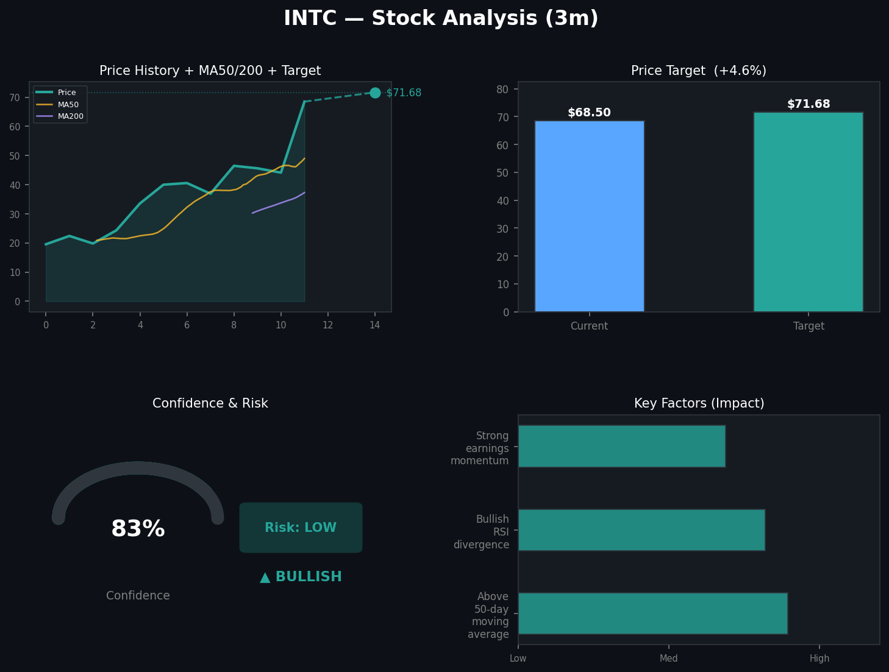
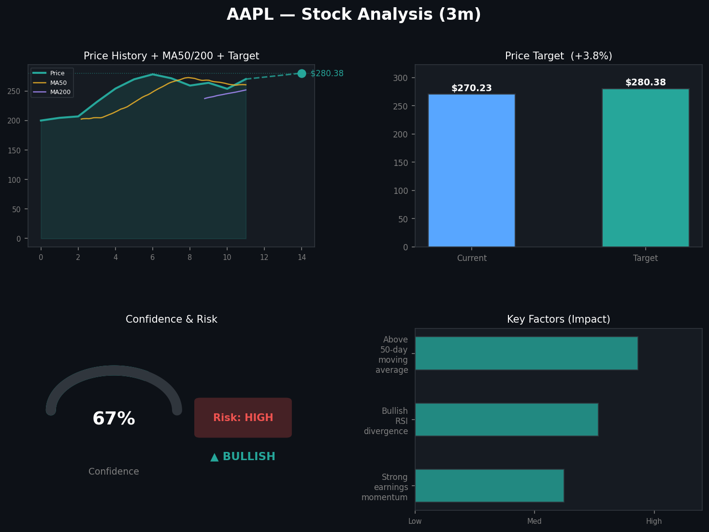
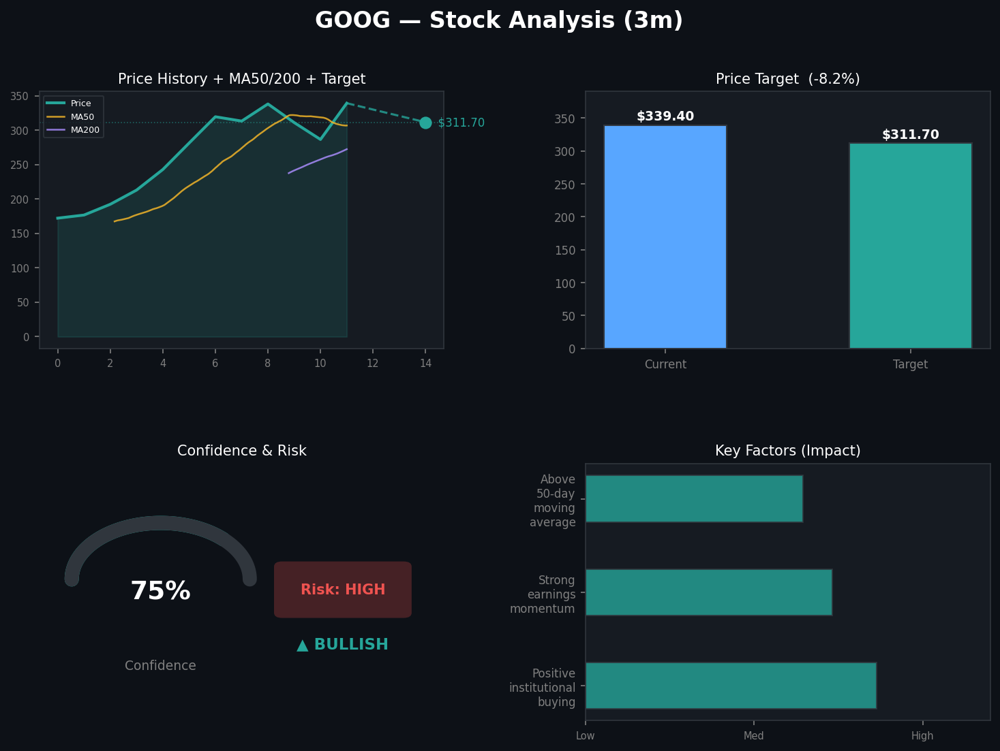
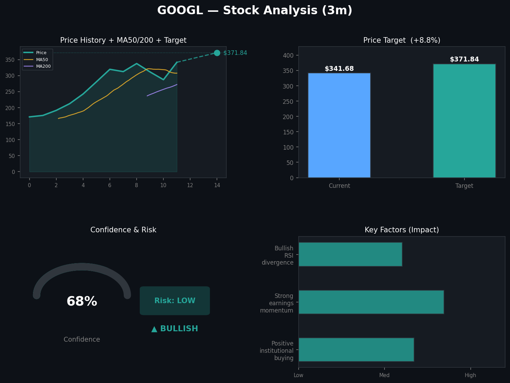
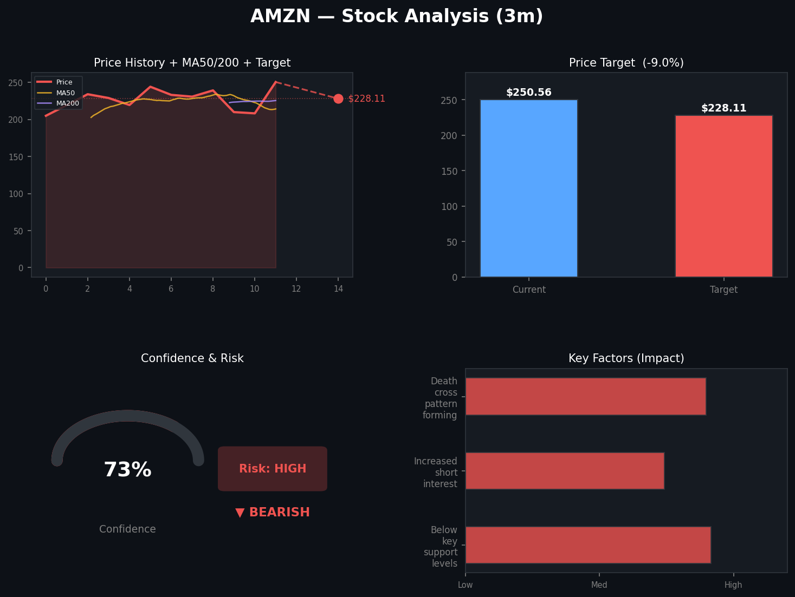
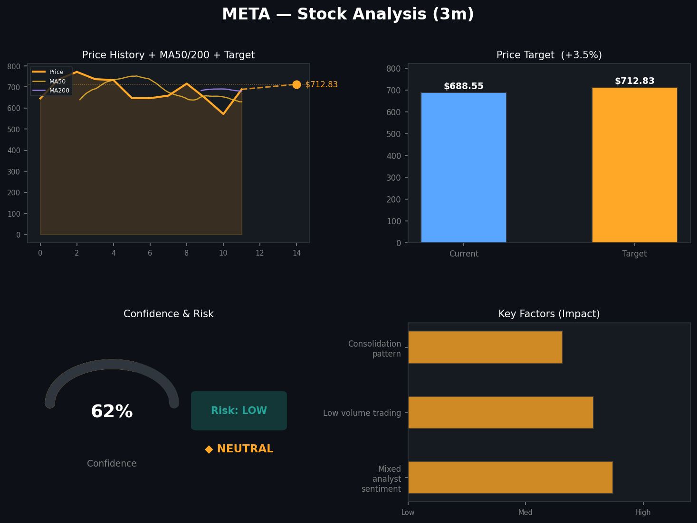
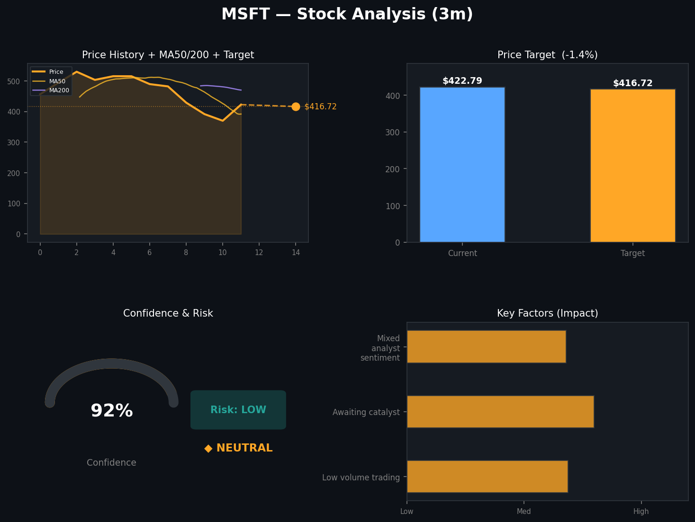
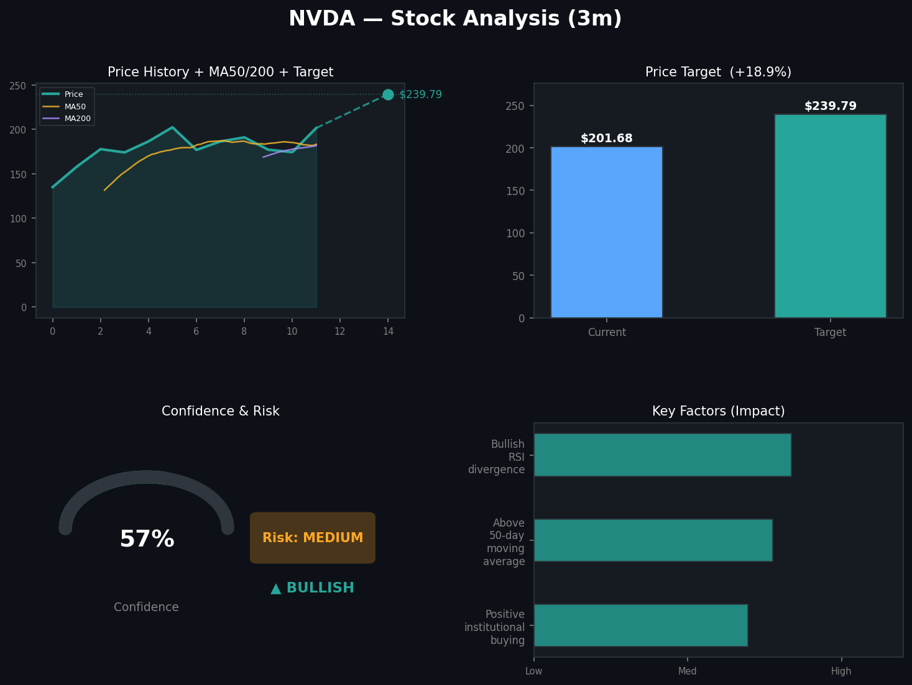
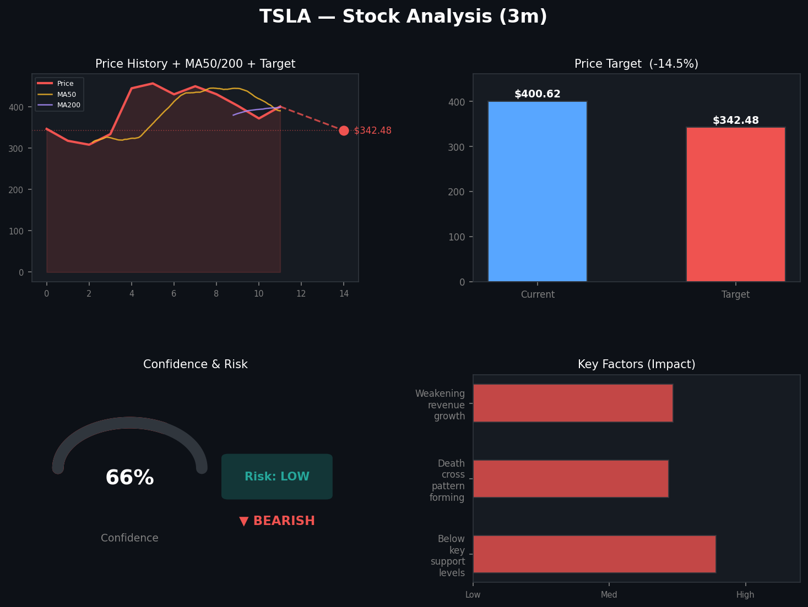

# Stock Predictions

**Generated:** 2026-04-19 19:06:47

**Tickers:** INTC, AAPL, GOOG, GOOGL, AMZN, META, MSFT, NVDA, TSLA  
**Timeframe:** 3m  
**Model:** claude-opus-4-7

---

## INTC — 3m Prediction

## INTC 3-Month Stock Prediction Analysis

Here's the outlook for Intel Corporation (INTC) over the next 3 months:

### 📊 Prediction Summary
- **Direction:** Bullish 📈
- **Confidence Level:** 83% (High)
- **Current Price:** $68.50
- **Price Target:** $71.68
- **Target Date:** July 18, 2026
- **Implied Upside:** ~4.6%
- **Risk Level:** Low

### 🔑 Key Factors Driving the Prediction
1. **Above 50-day moving average** — Indicates a sustained positive price trend
2. **Bullish RSI divergence** — Technical momentum signal suggesting further upside potential
3. **Strong earnings momentum** — Positive fundamental support from recent financial performance

### 💡 Takeaway
The model presents a fairly optimistic outlook for INTC over the next 3 months, supported by both technical indicators and fundamental strength. The combination of high confidence (83%) and low risk rating suggests a relatively favorable risk/reward setup, though the projected upside (~4.6%) is modest.

---

⚠️ **Disclaimer:** This prediction is generated by an algorithmic model and is **not financial advice**. Stock markets are inherently unpredictable, and past performance does not guarantee future results. Always conduct your own research and consider consulting a licensed financial advisor before making investment decisions.

---

## AAPL — 3m Prediction

## AAPL 3-Month Prediction Analysis

Here's the breakdown of the forecast for Apple (AAPL) over the next 3 months:

### 📊 Prediction Summary
- **Direction:** Bullish 📈
- **Confidence:** 67%
- **Current Price:** $270.23
- **Price Target:** $280.38 (~3.8% upside)
- **Risk Level:** High ⚠️

### 🔑 Key Factors Driving the Outlook
1. **Strong earnings momentum** — Apple's recent financial performance is supporting upward price action.
2. **Bullish RSI divergence** — Technical indicators suggest underlying strength even if price action has been mixed.
3. **Above 50-day moving average** — A classic bullish signal indicating the medium-term trend remains positive.

### 💡 Takeaway
The model projects modest upside for AAPL over the next 3 months, with a moderate confidence level of 67%. However, the **high risk rating** suggests notable volatility could be expected along the way, so the path to the target may not be smooth. The projected ~3.8% gain is relatively conservative, reflecting the uncertainty baked into the forecast.

---

⚠️ **Disclaimer:** This prediction is generated by an analytical model and is **not financial advice**. Stock markets are inherently unpredictable, and you should conduct your own research and/or consult a licensed financial advisor before making any investment decisions.

---

## GOOG — 3m Prediction

## GOOG 3-Month Stock Prediction Analysis

Here's the prediction summary for Alphabet (GOOG):

| Metric | Value |
|---|---|
| **Direction** | Bullish 📈 |
| **Confidence** | 75% |
| **Current Price** | $339.40 |
| **Price Target** | $311.70 |
| **Target Date** | July 18, 2026 |
| **Risk Level** | High ⚠️ |

### Key Factors Driving the Prediction
- ✅ **Positive institutional buying** – Large investors are accumulating shares
- ✅ **Strong earnings momentum** – Recent earnings trends are supportive
- ✅ **Above 50-day moving average** – Technical indicator suggests an uptrend

### ⚠️ Important Observation
There's a notable **inconsistency** in this prediction worth flagging: while the direction is labeled **bullish** with 75% confidence, the price target of **$311.70 is actually ~8.2% below** the current price of $339.40. This contradiction, combined with the **high risk level**, suggests the outlook is more ambiguous than the headline "bullish" label implies. You may want to treat this signal with extra caution.

### Takeaway
The underlying fundamentals and technicals (institutional buying, earnings momentum, trend position) appear supportive, but the quantitative price target points to potential downside. The high risk rating suggests elevated volatility is expected over the next 3 months.

---

*⚠️ **Disclaimer:** This prediction is generated by an analytical model and is **not financial advice**. Stock markets are inherently unpredictable, and past performance does not guarantee future results. Always conduct your own research and consult a licensed financial advisor before making investment decisions.*

---

## GOOGL — 3m Prediction

# GOOGL 3-Month Prediction Analysis

## 📊 Summary
The prediction for **Alphabet (GOOGL)** over the next 3 months is **bullish** with moderate confidence.

## Key Metrics
| Metric | Value |
|---|---|
| **Current Price** | $341.68 |
| **Price Target** | $371.84 |
| **Implied Upside** | ~8.8% |
| **Direction** | Bullish 📈 |
| **Confidence** | 68% |
| **Risk Level** | Low |
| **Target Date** | July 18, 2026 |

## Key Factors Driving the Outlook
1. **Positive institutional buying** – Suggests larger investors are accumulating shares, often a signal of confidence in fundamentals.
2. **Strong earnings momentum** – Indicates GOOGL's recent financial performance is trending favorably, supporting continued growth.
3. **Bullish RSI divergence** – A technical indicator suggesting upward price momentum may continue despite short-term fluctuations.

## Takeaway
The model projects a moderate ~8.8% gain over the 3-month window with a **low risk profile**, supported by both fundamental (earnings, institutional activity) and technical (RSI) factors. The 68% confidence level indicates a reasonably strong but not overwhelming signal.

---
⚠️ **Disclaimer:** This prediction is generated by an algorithmic model and is **not financial advice**. Stock markets are inherently unpredictable, and past performance does not guarantee future results. Always conduct your own research and consider consulting a licensed financial advisor before making investment decisions.

---

## AMZN — 3m Prediction

# AMZN 3-Month Prediction Analysis

## 📊 Summary
The prediction model is signaling a **bearish** outlook for Amazon (AMZN) over the next 3 months with **73% confidence**.

## Key Metrics
| Metric | Value |
|---|---|
| **Current Price** | $250.56 |
| **Price Target** | $228.11 |
| **Target Date** | July 18, 2026 |
| **Direction** | Bearish 🔻 |
| **Confidence** | 73% |
| **Risk Level** | High ⚠️ |
| **Implied Move** | ~-8.96% |

## Key Factors Driving the Prediction
1. **Below key support levels** – The stock has broken through important technical support zones, which often signals further downside.
2. **Increased short interest** – A growing number of traders are betting against AMZN, reflecting negative sentiment.
3. **Death cross pattern forming** – A bearish technical indicator where the short-term moving average crosses below the long-term moving average, historically associated with extended declines.

## Analysis
The combination of weakening technical support, rising short interest, and an emerging death cross pattern suggests meaningful downside pressure. The **high risk level** warrants extra caution — while the model has moderately strong confidence in the bearish direction, high-risk predictions can experience significant volatility in either direction.

---

⚠️ **Disclaimer:** This prediction is generated by an algorithmic model and is **not financial advice**. Stock markets are inherently unpredictable, and past patterns don't guarantee future results. Always conduct your own research and consult a licensed financial advisor before making investment decisions.

---

## META — 3m Prediction

## META 3-Month Prediction Analysis

Here's the forecast for Meta Platforms (META) over the next 3 months:

| Metric | Value |
|---|---|
| **Current Price** | $688.55 |
| **Price Target** | $712.83 |
| **Implied Upside** | ~3.5% |
| **Direction** | Neutral |
| **Confidence** | 62% |
| **Risk Level** | Low |

### Key Factors Driving the Prediction
- **Mixed analyst sentiment** – The Street appears divided on META's near-term trajectory, offsetting more decisive directional momentum.
- **Low volume trading** – Reduced trading activity suggests limited conviction from either bulls or bears.
- **Consolidation pattern** – The stock appears to be trading within a defined range, typical of a market digesting prior moves before its next leg.

### Takeaway
The model projects a **modest ~3.5% gain** over the next 3 months with a **neutral bias** and **low risk profile**. The 62% confidence level is moderate, reflecting the mixed signals in the market. In short: don't expect fireworks, but also don't expect a major drawdown based on current indicators — META looks like it's in a "wait and see" phase.

---
⚠️ **Disclaimer:** This prediction is generated by an algorithmic model and should **not** be considered financial advice. Stock markets are inherently unpredictable, and past patterns do not guarantee future results. Always conduct your own research and consult a licensed financial advisor before making investment decisions.

---

## MSFT — 3m Prediction

## MSFT 3-Month Prediction Analysis

Here's the outlook for Microsoft (MSFT) over the next 3 months:

### Key Metrics
- **Current Price:** $422.79
- **Price Target:** $416.72 (by ~July 2026)
- **Direction:** Neutral 📊
- **Confidence:** 92% (very high)
- **Risk Level:** Low

### Summary
The model projects a **slightly bearish to flat** performance, with the price target implying a modest decline of approximately **-1.4%** from current levels. Despite the high confidence score, the movement itself is expected to be minimal, suggesting MSFT may trade sideways rather than experience significant swings.

### Key Factors Driving the Prediction
1. **Low volume trading** – Reduced market participation is limiting price momentum in either direction.
2. **Awaiting catalyst** – The stock appears to be in a holding pattern, likely awaiting an earnings report, product announcement, or macroeconomic signal.
3. **Mixed analyst sentiment** – Street opinions are divided, contributing to the lack of clear directional bias.

### Takeaway
MSFT looks like a **consolidation play** over the next 3 months—low risk, but also limited upside based on this forecast. Investors holding MSFT may see stable performance, while those seeking near-term growth may want to wait for a clearer catalyst.

---
⚠️ **Disclaimer:** This prediction is generated by an analytical model and is **not financial advice**. Stock markets are inherently unpredictable, and you should conduct your own research or consult a licensed financial advisor before making investment decisions.

---

## NVDA — 3m Prediction

## NVDA 3-Month Prediction Analysis

**Current Price:** $201.68
**Price Target:** $239.79 (by ~July 18, 2026)
**Direction:** Bullish 📈
**Confidence:** 58% (moderate)
**Risk Level:** Medium

### Key Insights
- **Potential Upside:** ~18.9% over the 3-month horizon if the target is reached.
- **Supportive Factors:**
  - **Positive institutional buying** — suggests larger investors are accumulating shares, which often signals confidence in the company's fundamentals.
  - **Trading above 50-day moving average** — a classic bullish technical indicator showing sustained upward momentum.
  - **Bullish RSI divergence** — momentum indicators suggest strengthening conditions that may precede further price gains.

### Considerations
- The 58% confidence level is moderate, not high — meaning there's meaningful uncertainty in this forecast.
- Medium risk indicates typical market volatility should be expected, and NVDA in particular can experience sharp swings given its exposure to AI/semiconductor sentiment.

---
⚠️ **Disclaimer:** This prediction is generated from an analytical model and is **not financial advice**. Stock markets are inherently unpredictable, and past patterns do not guarantee future results. Please conduct your own research and consider consulting a licensed financial advisor before making investment decisions.

---

## TSLA — 3m Prediction

## TSLA 3-Month Prediction Analysis

**Current Price:** $400.62
**Price Target:** $342.48 (by July 18, 2026)
**Direction:** 📉 Bearish
**Confidence:** 66%
**Risk Level:** Low

### Key Insights

The model projects a **~14.5% decline** in TSLA over the next 3 months, with moderate confidence. The bearish outlook is driven by three main factors:

1. **Below Key Support Levels** – The stock has broken through important technical support, suggesting further downside momentum.
2. **Death Cross Pattern Forming** – A bearish technical signal where the short-term moving average crosses below the long-term moving average, historically associated with extended downtrends.
3. **Weakening Revenue Growth** – Fundamental concerns around slowing top-line growth are weighing on sentiment.

### Summary

With a 66% confidence bearish signal and both technical and fundamental headwinds aligning, the model suggests caution on TSLA over the intermediate term. However, the "low" risk rating indicates the predicted move is expected to be relatively orderly rather than volatile.

---

⚠️ **Disclaimer:** This prediction is generated by an analytical model and should **not** be considered financial advice. Stock markets are inherently unpredictable, and you should conduct your own research and/or consult a licensed financial advisor before making any investment decisions.

---

