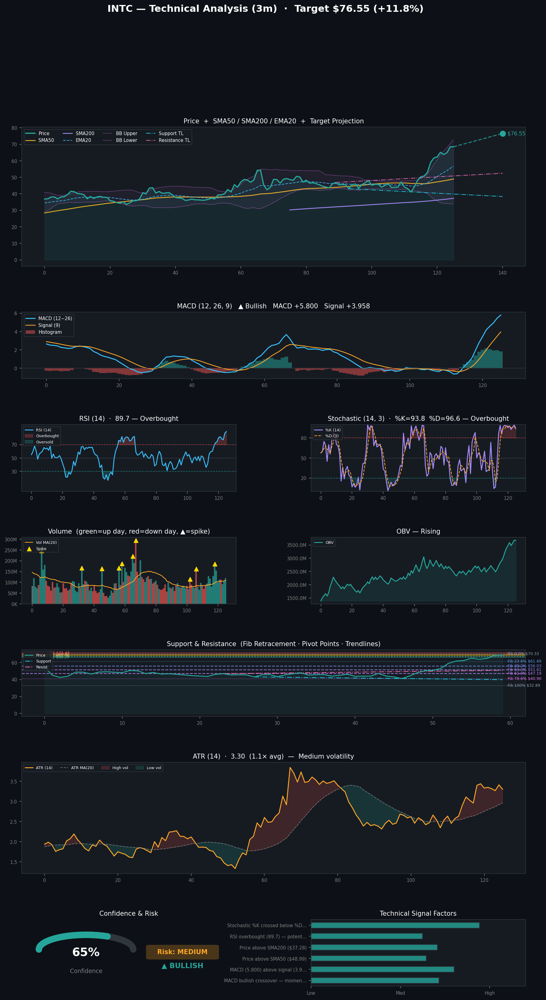
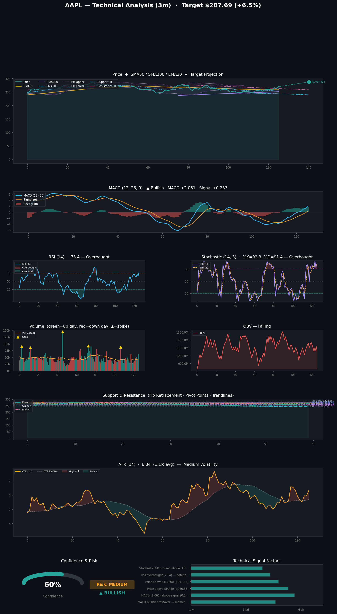
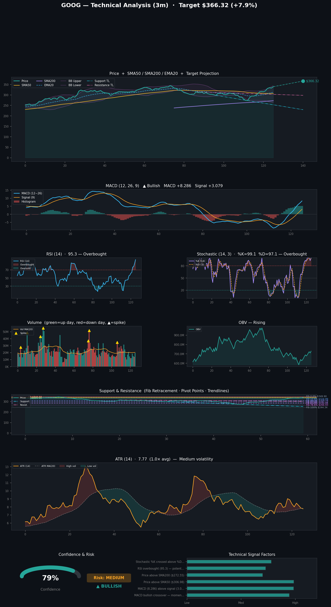
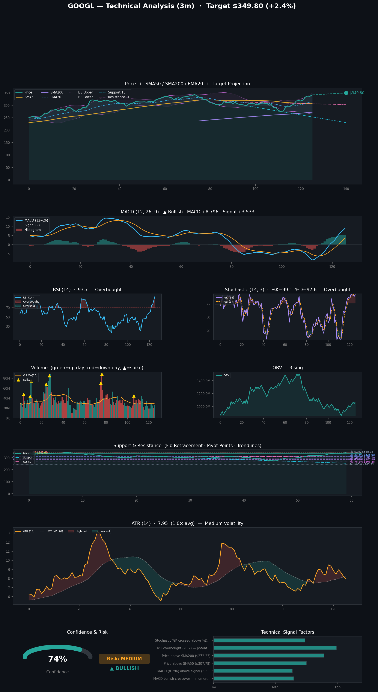
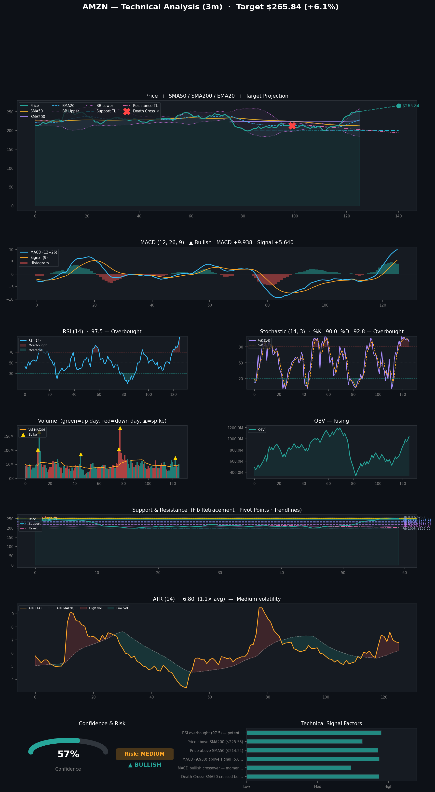
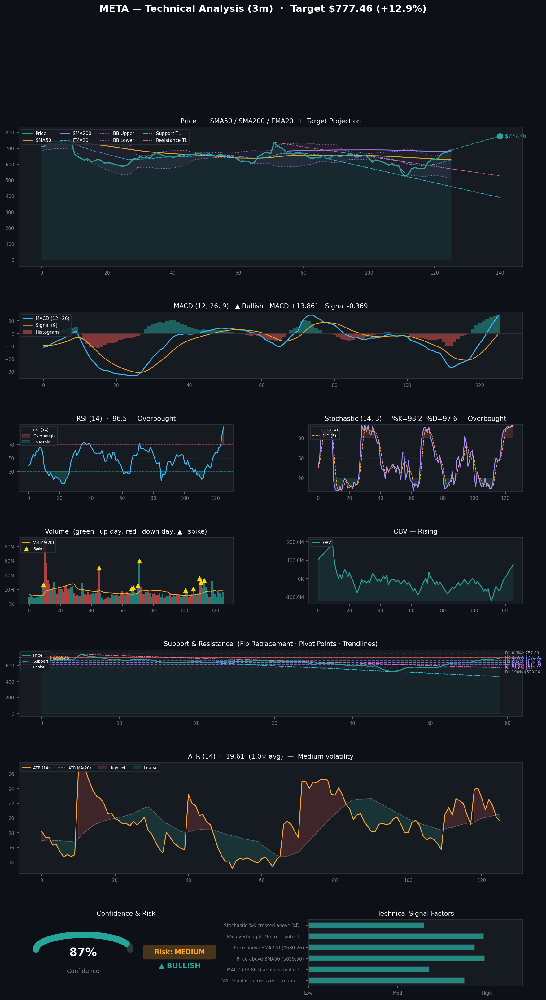
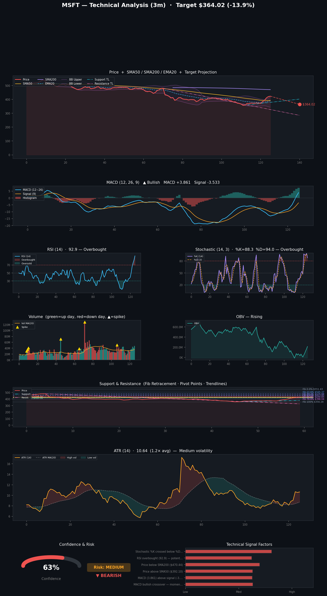
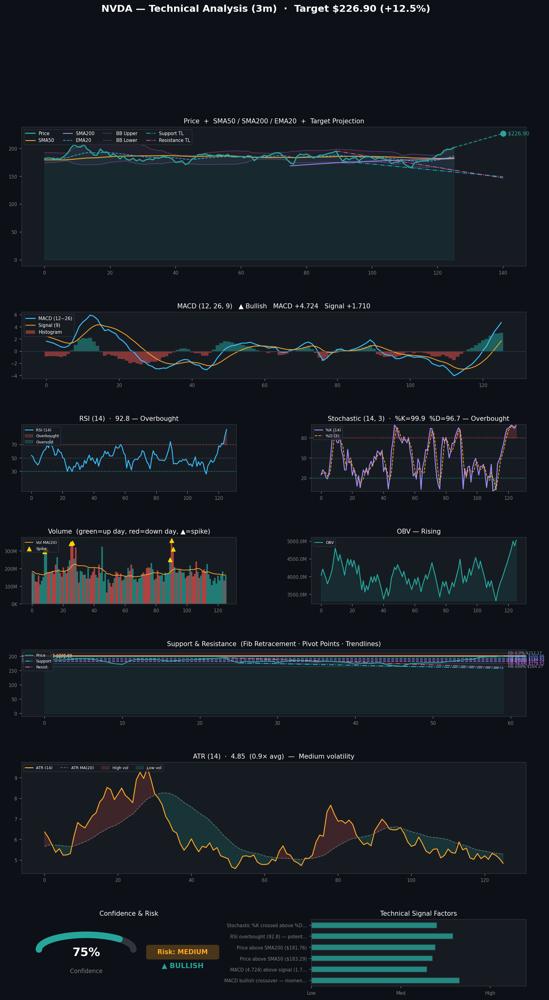
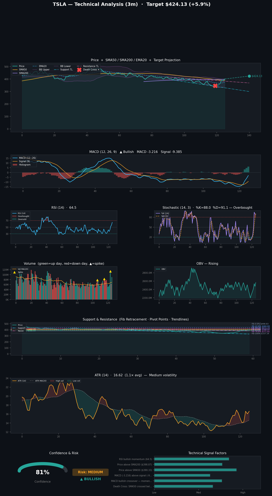

# Stock Predictions

**Generated:** 2026-04-20 01:36:59

**Tickers:** INTC, AAPL, GOOG, GOOGL, AMZN, META, MSFT, NVDA, TSLA  
**Timeframe:** 3m  
**Model:** claude-sonnet-4-6

---

## INTC — 3m Prediction

## 📊 INTC (Intel Corporation) — 3-Month Stock Prediction Analysis

---

### 🔮 Prediction Summary

| Metric | Value |
|---|---|
| **Direction** | 🟢 Bullish |
| **Confidence Score** | 65% |
| **Current Price** | $68.50 |
| **Price Target** | $76.55 |
| **Potential Upside** | ~+11.7% |
| **Target Date** | July 19, 2026 |
| **Risk Level** | ⚠️ Medium |

---

### 📈 Key Bullish Signals

- ✅ **MACD Bullish Crossover** — Momentum is building, with the MACD line (5.80) trading above the signal line (3.96), indicating positive price momentum.
- ✅ **Price Above SMA50 ($48.99)** — INTC is trading well above its 50-day moving average, signaling a short-to-medium-term uptrend.
- ✅ **Price Above SMA200 ($37.28)** — Trading above the 200-day moving average supports a longer-term bullish bias.
- ✅ **OBV (On-Balance Volume) Trend: Rising** — Increasing volume on up days suggests institutional accumulation.
- ✅ **Price Above Trendline Support** — The stock is holding above its key support trendline.

---

### ⚠️ Key Bearish / Cautionary Signals

- 🔴 **RSI Overbought at 89.7** — The Relative Strength Index is deep in overbought territory (above 70), which significantly raises the risk of a **near-term pullback or correction**.
- 🔴 **Stochastic %K Crossed Below %D (Bearish)** — This bearish stochastic crossover suggests short-term momentum may be fading.
- 🔴 **Elevated ATR (Average True Range)** — Volatility is relatively high, meaning price swings in either direction could be significant.

---

### 🧭 Key Technical Levels

| Level | Price |
|---|---|
| **Pivot Point (PP)** | $68.86 |
| **Resistance 1 (R1)** | $69.97 |
| **Resistance 2 (R2)** | $71.45 |
| **Support 1 (S1)** | $67.38 |
| **Support 2 (S2)** | $66.27 |

**Fibonacci Retracement Levels (for risk management):**
- 23.6%: $61.49 | 38.2%: $56.03 | 50.0%: $51.61

---

### 🧠 Overall Interpretation

The model leans **moderately bullish** on INTC over the next 3 months, targeting **$76.55** — an ~11.7% gain from current levels. The longer-term technical picture (MACD crossover, strong price vs. moving averages, rising OBV) supports this outlook. However, the **extremely high RSI of 89.7** is a major caution flag — INTC may need to consolidate or pull back before continuing higher. Traders should watch the **$67.38–$66.27 support zone** as a potential re-entry area if a dip occurs.

---

> ⚠️ **Disclaimer:** This analysis is generated from technical indicators and historical patterns and is **not financial advice**. Stock markets are inherently unpredictable, and past patterns do not guarantee future results. Always conduct your own due diligence and consult a licensed financial advisor before making investment decisions.

---

## AAPL — 3m Prediction

## 📊 AAPL Stock Prediction — 3-Month Outlook

Here's a comprehensive breakdown of the 3-month prediction for **Apple Inc. (AAPL)**:

---

### 🔮 Prediction Summary

| Metric | Value |
|---|---|
| **Direction** | 🟢 Bullish |
| **Confidence Score** | 60% |
| **Current Price** | $270.23 |
| **Price Target** | $287.69 |
| **Projected Gain** | ~+6.5% |
| **Target Date** | July 19, 2026 |
| **Risk Level** | ⚠️ Medium |

---

### 📈 Key Technical Factors

**Bullish Signals:**
- ✅ **MACD Bullish Crossover** — Momentum is building, with the MACD line (2.061) clearly above the signal line (0.237)
- ✅ **Price Above SMA50 ($260.55)** — Short-term trend is upward
- ✅ **Price Above SMA200 ($251.83)** — Long-term trend remains intact
- ✅ **Stochastic %K crossed above %D** — Another bullish confirmation signal

**Bearish/Caution Signals:**
- ⚠️ **RSI Overbought at 73.4** — AAPL is in overbought territory, which could signal a near-term pullback or consolidation before continuing higher
- ⚠️ **OBV Trend is Falling** — On-Balance Volume is declining, suggesting selling pressure may be lurking beneath the surface

---

### 🔑 Key Price Levels

| Level | Price |
|---|---|
| **Current Price** | $270.23 |
| **Resistance (R1)** | $272.78 |
| **Resistance (R2)** | $275.33 |
| **Support (S1)** | $267.20 |
| **Support (S2)** | $264.17 |
| **Price Target** | $287.69 |

**Fibonacci Levels:**
- 38.2% retracement: $271.10
- 50.0% retracement: $265.77
- 61.8% retracement: $260.44

---

### 🧠 Analyst Take

The overall outlook for AAPL over the next 3 months leans **moderately bullish**, supported by strong moving average alignment and a fresh MACD crossover. The price has solid footing above both its 50-day and 200-day moving averages. However, the **overbought RSI (73.4)** and **declining OBV** are worth watching — these factors temper conviction and suggest the stock may experience a short-term pullback or sideways consolidation before potentially reaching the $287.69 target.

The **medium risk level** and **60% confidence score** reflect a reasonably positive, but not overwhelmingly convincing, setup at current prices.

---

> ⚠️ **Disclaimer:** This analysis is generated using technical indicators and algorithmic modeling. It is **not financial advice**. Always conduct your own research and consult a qualified financial advisor before making any investment decisions.

---

## GOOG — 3m Prediction

## 📊 GOOG Stock Prediction — 3-Month Outlook

Here's a comprehensive breakdown of the prediction results for **Alphabet Inc. (GOOG)**:

---

### 🔮 Prediction Summary
| Metric | Value |
|---|---|
| **Direction** | 📈 **Bullish** |
| **Confidence Score** | **79%** |
| **Current Price** | **$339.40** |
| **Price Target** | **$366.32** |
| **Target Date** | **July 19, 2026** |
| **Risk Level** | ⚠️ Medium |

The model predicts an upside of approximately **$26.92 (+7.9%)** over the next 3 months.

---

### 📈 Key Bullish Factors
- ✅ **MACD Bullish Crossover** — Strong upward momentum is building, with the MACD line (8.29) well above the signal line (3.08).
- ✅ **Price Above SMA50 ($306.98)** — The stock is trading significantly above its 50-day moving average, confirming near-term trend strength.
- ✅ **Price Above SMA200 ($272.55)** — Long-term trend remains firmly bullish.
- ✅ **Stochastic Crossover (Bullish)** — The %K line has crossed above %D, signaling fresh buying momentum.

---

### ⚠️ Key Risk Factor
- 🚨 **RSI Overbought at 95.3** — This is an extremely elevated reading, well above the standard overbought threshold of 70. This raises the possibility of a **near-term pullback or consolidation** before the stock resumes its uptrend.

---

### 🛡️ Key Technical Levels
| Level | Price |
|---|---|
| **Resistance (R1)** | $341.83 |
| **Resistance (R2)** | $344.25 |
| **Pivot Point** | $337.56 |
| **Support (S1)** | $335.13 |
| **Support (S2)** | $330.86 |

**Fibonacci Retracement Levels** suggest key support zones at **$324.99 (23.6%)**, **$309.58 (38.2%)**, and **$297.12 (50%)** in the event of a dip.

---

### 💡 Analyst Take
The overall picture for GOOG over the next 3 months is **cautiously optimistic**. Strong momentum indicators (MACD, Stochastic, moving averages) support the bullish case, and the OBV trend is rising — indicating accumulation. However, the **extremely overbought RSI (95.3)** is a notable caution flag; short-term traders may want to watch for a pullback toward support levels before entering.

---

> ⚠️ **Disclaimer:** This analysis is generated from technical indicators and algorithmic models. It is **not financial advice**. Always conduct your own research and consult a qualified financial advisor before making any investment decisions.

---

## GOOGL — 3m Prediction

## 📊 GOOGL 3-Month Stock Prediction Analysis

Here's a comprehensive breakdown of the prediction results for **Alphabet Inc. (GOOGL)**:

---

### 🔮 Prediction Summary

| Metric | Value |
|---|---|
| **Direction** | 🟢 **Bullish** |
| **Confidence Score** | **74%** |
| **Current Price** | **$341.68** |
| **Price Target** | **$349.80** |
| **Target Date** | **July 19, 2026** |
| **Risk Level** | ⚠️ **Medium** |
| **Estimated Upside** | **+$8.12 (~+2.4%)** |

---

### 📈 Bullish Factors (Why It May Go Up)

- ✅ **MACD Bullish Crossover** — Momentum is building, with the MACD line (8.80) significantly above the signal line (3.53), a strong indicator of upward momentum.
- ✅ **Price Above SMA50 ($307.78)** — GOOGL is trading well above its 50-day simple moving average, a sign of near-term strength.
- ✅ **Price Above SMA200 ($272.23)** — Trading above the 200-day SMA indicates a solid long-term uptrend.
- ✅ **Stochastic %K Crossed Above %D** — This is a bullish signal, often indicating upward price continuation.
- ✅ **Rising OBV (On-Balance Volume)** — Volume is confirming the bullish price trend.

---

### ⚠️ Risk Factors (What Could Hold It Back)

- 🔴 **RSI Overbought (93.7)** — An RSI above 70 is considered overbought; at 93.7, this is extremely elevated and signals a **potential near-term pullback or consolidation**.
- 🔴 **Bollinger Bands** — Price is trading within bands, but the upper band near **$347–$350** aligns closely with the price target, suggesting resistance at that level.
- 🔴 **Fibonacci Resistance** — The 0% Fibonacci level sits at **$348.75**, right near the price target, which could act as resistance.

---

### 🧭 Key Technical Levels

| Level | Price |
|---|---|
| **Pivot Point (PP)** | $340.08 |
| **Resistance 1 (R1)** | $343.92 |
| **Resistance 2 (R2)** | $346.16 |
| **Support 1 (S1)** | $337.84 |
| **Support 2 (S2)** | $334.00 |

---

### 💡 Overall Takeaway

GOOGL shows **moderately bullish momentum** over the next 3 months, with a modest price target of **~$349.80 (+2.4%)**. The trend is supported by strong moving average positioning and bullish MACD signals. However, the **extremely overbought RSI (93.7)** is a key caution flag — a short-term pullback or consolidation is quite possible before any further upside is realized. Watch the **$337–$340 support zone** as a potential re-entry area if a dip occurs.

---

> ⚠️ **Disclaimer:** This analysis is generated using technical indicators and algorithmic models and is **not financial advice**. Stock markets are inherently unpredictable. Always conduct your own research and consult a licensed financial advisor before making any investment decisions.

---

## AMZN — 3m Prediction

Here's a comprehensive analysis of **Amazon (AMZN)** over the next **3 months**, based on the prediction data:

---

## 📊 AMZN 3-Month Stock Prediction Summary

| Metric | Value |
|---|---|
| **Current Price** | $250.56 |
| **Price Target** | $265.84 |
| **Direction** | 📈 Bullish |
| **Confidence Score** | 58% |
| **Risk Level** | Medium |
| **Target Date** | July 19, 2026 |

---

## 🔍 Key Technical Indicators

### ✅ Bullish Signals
- **MACD Bullish Crossover**: The MACD line (9.94) is above the signal line (5.64), indicating building upward momentum.
- **Price Above Key Moving Averages**: AMZN is trading above both its **SMA50 ($214.24)** and **SMA200 ($225.58)**, reflecting a strong medium-to-long-term uptrend.
- **Rising OBV (On-Balance Volume)**: Volume is confirming price movement, suggesting genuine buying interest.
- **Above Support**: The stock is trading above its support trendline, keeping the bullish structure intact.

### ⚠️ Bearish / Cautionary Signals
- **Death Cross**: The SMA50 recently crossed **below** the SMA200 (Death Cross at index 223), which is traditionally a longer-term bearish signal and a notable concern.
- **RSI Extremely Overbought (97.5)**: An RSI this high is rare and strongly suggests the stock may be **due for a pullback or consolidation** in the near term.
- **Stochastic Bearish Crossover**: The stochastic indicator is showing a bearish crossover, adding further caution around short-term momentum.
- **Bollinger Bands**: Price is currently trading **within** the bands — not yet at an extreme, but the overbought RSI warrants watching.

---

## 📐 Key Price Levels

### Fibonacci Retracement Levels
| Level | Price |
|---|---|
| 0.0% (Resistance) | $258.60 |
| 23.6% | $243.83 |
| 38.2% | $234.69 |
| 50.0% | $227.30 |
| 61.8% | $219.91 |
| 100% (Support) | $196.00 |

### Pivot Points
| Level | Price |
|---|---|
| **R2 (Resistance)** | $258.35 |
| **R1 (Resistance)** | $254.46 |
| **PP (Pivot)** | $252.28 |
| **S1 (Support)** | $248.39 |
| **S2 (Support)** | $246.21 |

---

## 🧠 Overall Takeaway

The model projects a **moderately bullish outlook** for AMZN over the next 3 months, with a potential upside of approximately **+6.1%** from the current price ($250.56 → $265.84). The MACD and moving average structure are supportive of continued gains. However, the **extreme RSI reading of 97.5**, the **Death Cross**, and the **bearish stochastic crossover** are significant warning signs. A short-term correction or consolidation before any further upside is quite plausible.

Investors should watch the **$248–$246 support zone** (S1/S2) as a key area to monitor if a pullback occurs, and the **$254–$258 zone** as near-term resistance.

---

> ⚠️ **Disclaimer**: This analysis is generated from technical indicators and algorithmic models. It is **not financial advice**. Always conduct your own research and consult a qualified financial advisor before making any investment decisions. Past performance and technical signals do not guarantee future results.

---

## META — 3m Prediction

## 📊 META Stock Prediction — 3-Month Outlook

Here's a comprehensive breakdown of what the analysis reveals for **Meta Platforms, Inc. (META)**:

---

### 🔑 Summary
| Metric | Value |
|---|---|
| **Current Price** | $688.55 |
| **Price Target (3M)** | $777.46 |
| **Projected Upside** | +**12.9%** |
| **Direction** | 📈 **Bullish** |
| **Confidence Score** | **87%** |
| **Risk Level** | ⚠️ Medium |
| **Target Date** | July 19, 2026 |

---

### ✅ Bullish Signals
- **MACD Bullish Crossover** — MACD (13.86) is above the signal line (-0.37), indicating strong upward momentum building.
- **Price Above SMA50 ($629.56)** — META is trading comfortably above its 50-day moving average, a sign of short-term strength.
- **Price Above SMA200 ($680.26)** — Trading above the 200-day moving average confirms a long-term uptrend.
- **Stochastic %K crossed above %D** — A bullish crossover in the Stochastic oscillator suggests renewed buying momentum.
- **OBV Trend Rising** — On-Balance Volume is trending upward, indicating accumulation and institutional buying interest.

---

### ⚠️ Risk Factors to Watch
- **RSI Overbought at 96.5** — This is an extremely elevated RSI reading, well into overbought territory. This raises the risk of a short-term pullback or consolidation before any continued upside.
- **Medium ATR Volatility** — The Average True Range suggests moderate day-to-day price swings, so expect some turbulence along the way.
- **Resistance Zone** — Key resistance near the **$701–$737 range** (based on pivot points and trendlines) could slow momentum before pushing toward the price target.

---

### 📐 Key Technical Levels
| Level | Price |
|---|---|
| **Resistance 2 (R2)** | $701.46 |
| **Resistance 1 (R1)** | $695.00 |
| **Pivot Point** | $685.07 |
| **Support 1 (S1)** | $678.61 |
| **Support 2 (S2)** | $668.68 |

### 🔢 Fibonacci Retracement Levels
| Level | Price |
|---|---|
| 0% (Recent High) | $757.89 |
| 23.6% | $701.81 |
| 38.2% | $667.12 |
| 50% | $639.08 |
| 61.8% | $611.04 |
| 100% (Recent Low) | $520.26 |

---

### 💡 Analyst Take
META's technical picture is broadly **bullish** with strong trend confirmation across multiple indicators. The MACD crossover, rising OBV, and price sitting above both key moving averages all point to sustained buying pressure. The **87% confidence** score is notably high. However, the **RSI at 96.5 is a red flag** — this level of overbought conditions historically precedes short-term corrections. Investors may want to watch for a brief pullback toward the **$668–$678 support zone** as a potential re-entry or accumulation opportunity before the projected push to **$777.46**.

---

> ⚠️ **Disclaimer:** This analysis is for **informational purposes only** and does **not** constitute financial advice. Stock predictions are based on technical indicators and historical patterns, which do not guarantee future results. Always do your own research and consult a licensed financial advisor before making investment decisions.

---

## MSFT — 3m Prediction

Here's a comprehensive analysis of the **MSFT (Microsoft)** stock prediction over the next **3 months**:

---

## 📊 MSFT — 3-Month Prediction Summary

| Metric | Value |
|---|---|
| **Current Price** | $422.79 |
| **Price Target** | $364.02 |
| **Direction** | 🔴 Bearish |
| **Confidence** | 63% |
| **Risk Level** | Medium |
| **Target Date** | July 19, 2026 |

**Projected Downside: ~$58.77 (-13.9%)**

---

## 🔍 Key Factors Driving the Prediction

### 🐻 Bearish Signals (Caution):
- **RSI Overbought (92.9):** The Relative Strength Index is extremely elevated, well above the 70 overbought threshold. This signals the stock may be due for a significant pullback or reversal.
- **Price Below SMA200 ($470.44):** MSFT is trading beneath its 200-day moving average, indicating a longer-term downtrend remains in play.
- **Stochastic %K crossed below %D:** This bearish crossover on the Stochastic oscillator signals near-term selling momentum is building.

### 🟡 Mixed / Conflicting Signals:
- **MACD Bullish Crossover:** The MACD line (3.861) is above the signal line (-3.533), suggesting some short-term upward momentum. However, this conflicts with the broader bearish indicators.
- **Price Above SMA50 ($392.10):** While MSFT is above its 50-day moving average — a short-term positive — it still trails the 200-day average significantly.
- **Above Bollinger Band Upper:** The stock is trading above its upper Bollinger Band, which typically indicates it may be overextended and prone to a pullback.

---

## 📐 Key Technical Levels

| Level | Price |
|---|---|
| **Resistance (R2)** | $435.91 |
| **Resistance (R1)** | $429.35 |
| **Pivot Point** | $425.02 |
| **Support (S1)** | $418.46 |
| **Support (S2)** | $414.13 |

**Fibonacci Retracement Levels:**
- 23.6% → $505.37
- 38.2% → $476.88
- 50.0% → $453.85
- 61.8% → $430.83 *(near current price)*
- 78.6% → $398.04
- 100% → $356.28 *(near price target)*

---

## 🧠 Bottom Line

The model predicts a **bearish 3-month outlook** for MSFT with **63% confidence**, targeting a decline from ~$422.79 down to **~$364**, roughly in line with the 100% Fibonacci retracement level. The extreme RSI reading of 92.9 and the stock trading above its upper Bollinger Band are the most concerning signals. Meanwhile, the MACD bullish crossover offers a short-term counterargument, suggesting any near-term moves could still be upward before a larger correction takes hold.

---

> ⚠️ **Disclaimer:** This analysis is generated using technical indicators and algorithmic modeling. It is **not financial advice**. Always conduct your own research and consult with a licensed financial advisor before making any investment decisions. Past patterns do not guarantee future performance.

---

## NVDA — 3m Prediction

Here's a comprehensive analysis of NVDA's predicted stock performance over the next **3 months**, based on the latest data:

---

## 📊 NVDA — 3-Month Stock Prediction Summary

| Metric | Value |
|---|---|
| **Current Price** | $201.68 |
| **Price Target** | $226.90 |
| **Predicted Direction** | 🟢 **Bullish** |
| **Confidence Score** | **75%** |
| **Target Date** | July 19, 2026 |
| **Risk Level** | ⚠️ Medium |
| **Potential Upside** | ~**+12.5%** |

---

## 🔍 Key Technical Factors

### ✅ Bullish Signals
- **MACD Bullish Crossover**: The MACD line (4.724) is well above the signal line (1.710), indicating building upward momentum.
- **Price Above SMA50 ($183.29)**: NVDA is trading above its 50-day moving average, a classic bullish indicator.
- **Price Above SMA200 ($181.76)**: Trading above the 200-day moving average signals a long-term uptrend.
- **Stochastic %K Crossed Above %D**: This bullish crossover suggests near-term buying pressure is increasing.
- **Rising OBV (On-Balance Volume)**: Volume is trending upward alongside price, confirming buyer conviction.

### ⚠️ Caution Flags
- **RSI at 92.8 (Overbought)**: The Relative Strength Index is in heavily overbought territory — this raises the possibility of a **short-term pullback or consolidation** before any continued upside.
- **Medium ATR**: Volatility is moderate, meaning price swings could be significant in either direction.

---

## 📐 Key Price Levels

| Level | Price |
|---|---|
| **Resistance (R2)** | $203.31 |
| **Resistance (R1)** | $202.50 |
| **Pivot Point** | $200.88 |
| **Support (S1)** | $200.07 |
| **Support (S2)** | $198.45 |

**Fibonacci Levels** suggest key support zones at **$193.87 (38.2%)**, **$188.22 (50%)**, and **$182.57 (61.8%)** in case of a correction.

---

## 🧠 Overall Assessment

NVDA shows a **predominantly bullish outlook** for the next 3 months, supported by strong momentum indicators, a confirmed MACD crossover, and a price firmly above both key moving averages. The predicted price target of **$226.90** implies roughly **12.5% upside** from the current level.

However, the **extremely high RSI of 92.8** warrants caution — the stock may experience short-term volatility or a pullback before resuming its upward trend. Investors should watch the **$198–$200 support zone** as a key level to hold.

---

> ⚠️ **Disclaimer**: This analysis is for **informational purposes only** and does **not** constitute financial advice. Stock predictions are inherently uncertain, and past performance is not indicative of future results. Always consult a qualified financial advisor before making investment decisions.

---

## TSLA — 3m Prediction

## 📊 Tesla (TSLA) — 3-Month Stock Prediction Analysis

---

### 🔮 Prediction Summary

| Metric | Value |
|---|---|
| **Direction** | 🟢 Bullish |
| **Confidence Score** | 81% |
| **Current Price** | $400.62 |
| **Price Target** | $424.13 |
| **Projected Gain** | ~+$23.51 (+5.87%) |
| **Target Date** | July 19, 2026 |
| **Risk Level** | ⚠️ Medium |

---

### 📈 Key Bullish Factors

1. **MACD Bullish Crossover** — Momentum is building as the MACD line (-3.216) has crossed above the signal line (-9.385), a classic bullish signal.
2. **Price Above SMA50 ($390.33)** — TSLA is trading above its 50-day moving average, suggesting short-term upward strength.
3. **Price Above SMA200 ($398.87)** — Trading above the 200-day moving average indicates sustained longer-term momentum.
4. **RSI at 64.5** — In bullish territory without being overbought (below 70), suggesting room for further upside.
5. **Rising OBV (On-Balance Volume)** — Increasing accumulation by investors supports the bullish outlook.

---

### ⚠️ Key Risk Factor

- **Death Cross Detected** — The SMA50 recently crossed below the SMA200 (a "Death Cross"), which is traditionally a bearish long-term signal. This is a notable counterpoint to the bullish momentum indicators and is a key source of uncertainty.

---

### 📐 Technical Levels to Watch

| Level | Price |
|---|---|
| **Resistance R1** | $409.38 |
| **Resistance R2** | $418.15 |
| **Support S1** | $391.75 |
| **Support S2** | $382.89 |

**Fibonacci Levels:**
- 🔴 Near-term resistance: **$437.10** (38.2%) and **$460.69** (23.6%)
- 🟢 Key support zone: **$398.97** (61.8%) and **$371.82** (78.6%)

---

### 🧠 Overall Assessment

TSLA shows a **moderately bullish setup** over the next 3 months, with an 81% confidence score. Momentum indicators (MACD, RSI) and moving averages are supportive, but the **Death Cross** is a warning flag that should not be ignored. The stock appears to have a near-term path toward the **$409–$424 range**, but downside support at **$391–$382** is critical to hold.

---

> ⚠️ **Disclaimer:** This analysis is generated from technical indicators and algorithmic models and is **not financial advice**. Stock markets are inherently unpredictable. Always do your own research and consider consulting a licensed financial advisor before making any investment decisions.

---

