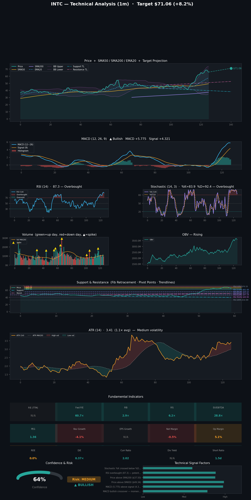

# Stock Predictions

**Generated:** 2026-04-20 17:14:55

**Tickers:** INTC  
**Timeframe:** 1m  
**Model:** claude-sonnet-4-6  
**Indicators:** fundamental, momentum, support, trend, volatility, volume

---

## INTC — 1m Prediction

Here's a breakdown of the prediction for **INTC (Intel Corporation)** over the next **1 month**:

---

### 📊 INTC — 1-Month Prediction Summary

| Metric | Details |
|---|---|
| **Direction** | 🟢 Bullish |
| **Confidence Score** | 64% |
| **Current Price** | $65.70 |
| **Price Target** | $71.06 |
| **Target Date** | May 20, 2026 |
| **Risk Level** | Medium |

---

### 🟢 Key Bullish Factors

1. **MACD Bullish Crossover** — Momentum is building as the MACD line has recently crossed above the signal line, a classic early-stage bullish signal.
2. **MACD Above Signal** — The MACD (5.775) is meaningfully elevated above the signal line (4.321), indicating sustained upward momentum pressure.
3. **Price Above SMA50** — INTC is trading well above its 50-day simple moving average ($49.34), confirming a medium-term bullish trend.
4. **Price Above SMA200** — Trading above the 200-day SMA ($37.50) signals a healthy long-term structural uptrend is in place.

---

### 🔴 Key Risk Factors / Bearish Signals

1. **RSI Overbought (87.3)** — The RSI is deep in overbought territory at 87.3, significantly above the 70 threshold, raising the risk of a near-term pullback or reversal.
2. **Stochastic %K Crossed Below %D (Bearish)** — The Stochastic oscillator has flashed a bearish crossover, suggesting short-term momentum may be rolling over despite the broader bullish trend.

---

### 📐 Technical Levels to Watch

| Level | Price |
|---|---|
| **Resistance 2 (R2)** | $70.77 |
| **Resistance 1 (R1)** | $68.24 |
| **Pivot Point (PP)** | $66.67 |
| **Support 1 (S1)** | $64.13 |
| **Support 2 (S2)** | $62.56 |

---

### 📏 Fibonacci Retracement Levels

| Level | Price |
|---|---|
| **100%** | $32.89 |
| **78.6%** | $40.90 |
| **61.8%** | $47.19 |
| **50.0%** | $51.61 |
| **38.2%** | $56.03 |
| **23.6%** | $61.49 |
| **0.0%** | $70.33 |

---

### 📝 Analysis

INTC presents a cautiously bullish outlook over the next month, supported by a MACD bullish crossover and its position comfortably above both the 50-day ($49.34) and 200-day ($37.50) moving averages. However, the RSI at an extreme 87.3 is a notable warning sign, suggesting the stock may be overextended and vulnerable to a short-term correction before continuing higher. The immediate resistance cluster around R1 ($68.24) and R2 ($70.77) aligns closely with the $71.06 price target, meaning bulls will need to push through these key technical barriers. Traders should monitor the $64.13 S1 support level closely — a breakdown there could invite further downside toward $62.56.

---

> ⚠️ **Disclaimer:** This prediction is generated by an analytical model and is **not financial advice**. Stock markets involve significant risk, and past performance does not guarantee future results. Always consult a qualified financial advisor before making investment decisions.

---

