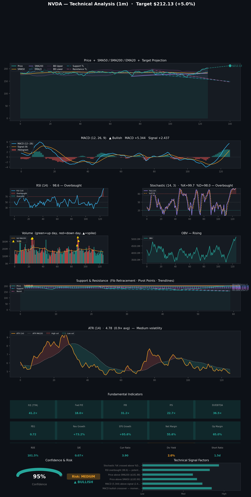

# Stock Predictions

**Generated:** 2026-04-20 17:48:46

**Tickers:** NVDA  
**Timeframe:** 1m  
**Model:** claude-sonnet-4-6  
**Indicators:** fundamental, momentum, support, trend, volatility, volume

---

## NVDA — 1m Prediction

Here's a breakdown of the prediction for **NVDA (NVIDIA Corporation)** over the next **1 month**:

---

### 📊 NVDA — 1-Month Prediction Summary

| Metric | Details |
|---|---|
| **Direction** | 🟢 Bullish |
| **Confidence Score** | 95% |
| **Current Price** | $202.06 |
| **Price Target** | $212.13 |
| **Target Date** | May 20, 2026 |
| **Risk Level** | Medium |

---

### 🟢 Key Bullish Factors

1. **MACD Bullish Crossover** — Momentum is actively building as the MACD has crossed into bullish territory, signaling a strengthening upward trend.
2. **MACD Above Signal Line** — With the MACD at 5.344 well above the signal line at 2.437, there is sustained positive momentum favoring buyers.
3. **Price Above SMA50** — NVDA is trading above its 50-day simple moving average of $183.90, confirming short-to-medium-term bullish trend momentum.
4. **Price Above SMA200** — Trading above the 200-day SMA of $181.98 signals a healthy long-term uptrend remains firmly intact.
5. **Stochastic %K Crossed Above %D** — A bullish stochastic crossover has occurred, suggesting renewed buying pressure and a potential continuation higher.

---

### 🔴 Key Risk Factors / Bearish Signals

1. **RSI Overbought (98.6)** — An extremely elevated RSI near 99 is a strong warning signal that the stock is severely overbought and is at high risk of a short-term pullback or reversal.

---

### 📐 Technical Levels to Watch

| Level | Price |
|---|---|
| **Resistance 2 (R2)** | $205.02 |
| **Resistance 1 (R1)** | $203.54 |
| **Pivot Point (PP)** | $200.69 |
| **Support 1 (S1)** | $199.21 |
| **Support 2 (S2)** | $196.36 |

---

### 📏 Fibonacci Retracement Levels

| Level | Price |
|---|---|
| **100%** | $164.27 |
| **78.6%** | $174.52 |
| **61.8%** | $182.57 |
| **50.0%** | $188.22 |
| **38.2%** | $193.87 |
| **23.6%** | $200.86 |
| **0.0%** | $212.17 |

---

### 📝 Analysis

NVDA presents a strongly bullish technical picture heading into the next month, with the model projecting a ~5% move higher toward the $212.13 price target — closely aligned with the 0.0% Fibonacci level at $212.17. The MACD bullish crossover and dual confirmation from the SMA50 ($183.90) and SMA200 ($181.98) underpin the upside case, while the stochastic crossover adds further confidence to near-term momentum. However, the near-parabolic RSI reading of 98.6 is the most significant risk to this thesis, as it indicates severely overbought conditions that could trigger a short-term consolidation or pullback toward the Pivot Point at $200.69 or the 23.6% Fibonacci level near $200.86 before any continuation higher. Investors should watch key resistance at R1 ($203.54) and R2 ($205.02) as immediate hurdles the stock must clear to sustain its bullish trajectory.

---

> ⚠️ **Disclaimer:** This prediction is generated by an analytical model and is **not financial advice**. Stock markets involve significant risk, and past performance does not guarantee future results. Always consult a qualified financial advisor before making investment decisions.

---

