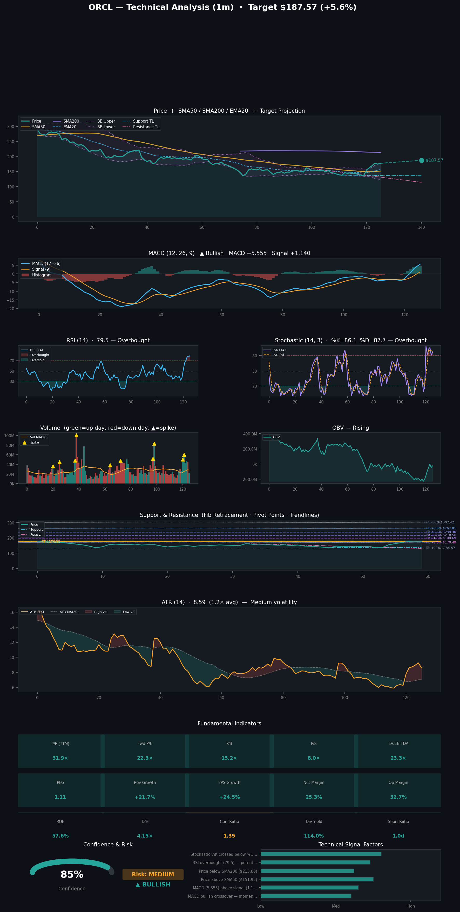

# Stock Predictions

**Generated:** 2026-04-20 17:54:02

**Tickers:** ORCL  
**Timeframe:** 1m  
**Model:** claude-sonnet-4-6  
**Indicators:** fundamental, momentum, support, trend, volatility, volume

---

## ORCL — 1m Prediction

Here's a breakdown of the prediction for **ORCL (Oracle Corporation)** over the next **1 month**:

---

### 📊 ORCL — 1-Month Prediction Summary

| Metric | Details |
|---|---|
| **Direction** | 🟢 Bullish |
| **Confidence Score** | 85% |
| **Current Price** | $177.58 |
| **Price Target** | $187.57 |
| **Target Date** | May 20, 2026 |
| **Risk Level** | Medium |

---

### 🟢 Key Bullish Factors

1. **MACD Bullish Crossover** — The MACD has crossed above the signal line, indicating building upward momentum in the stock.
2. **MACD Above Signal** — With the MACD at 5.555 and signal at 1.140, the positive divergence reinforces a strengthening bullish trend.
3. **Price Above SMA50** — ORCL is trading above its 50-day simple moving average ($151.95), confirming short- to medium-term trend strength.

---

### 🔴 Key Risk Factors / Bearish Signals

1. **Price Below SMA200** — ORCL is trading below its 200-day simple moving average ($213.80), signaling that the longer-term trend remains under pressure and the stock has not fully recovered.
2. **RSI Overbought (79.5)** — The RSI is in overbought territory at 79.5, raising the risk of a near-term pullback or mean reversion before further upside.
3. **Stochastic Bearish Crossover** — The Stochastic %K has crossed below %D, a short-term bearish signal that may indicate fading momentum in the immediate term.

---

### 📐 Technical Levels to Watch

| Level | Price |
|---|---|
| **Resistance 2 (R2)** | $180.53 |
| **Resistance 1 (R1)** | $179.06 |
| **Pivot Point (PP)** | $176.28 |
| **Support 1 (S1)** | $174.81 |
| **Support 2 (S2)** | $172.03 |

---

### 📏 Fibonacci Retracement Levels

| Level | Price |
|---|---|
| **100%** | $134.57 |
| **78.6%** | $170.49 |
| **61.8%** | $198.69 |
| **50.0%** | $218.50 |
| **38.2%** | $238.30 |
| **23.6%** | $262.81 |
| **0.0%** | $302.42 |

---

### 📝 Analysis

Oracle (ORCL) is showing a promising short-term bullish setup, driven by a MACD bullish crossover and its position above the 50-day SMA at $151.95, supporting a price target of $187.57 by May 20, 2026. However, the overbought RSI of 79.5 and a bearish Stochastic crossover suggest the stock may face near-term turbulence before continuing higher. Key resistance levels to watch are R1 at $179.06 and R2 at $180.53 — a sustained break above these would strengthen the bull case. Traders should remain cautious given ORCL still trades well below its 200-day SMA of $213.80, pointing to broader headwinds that remain in play.

---

> ⚠️ **Disclaimer:** This prediction is generated by an analytical model and is **not financial advice**. Stock markets involve significant risk, and past performance does not guarantee future results. Always consult a qualified financial advisor before making investment decisions.

---

